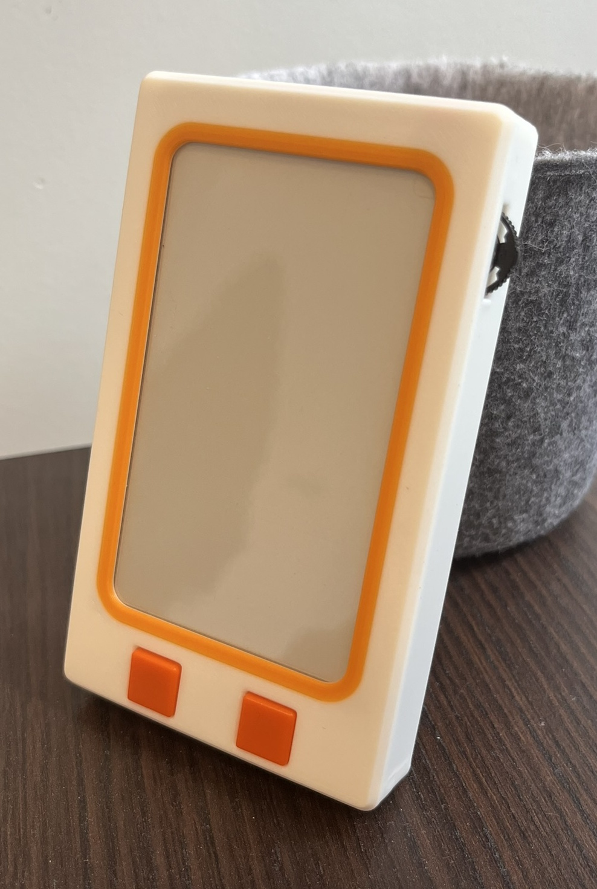
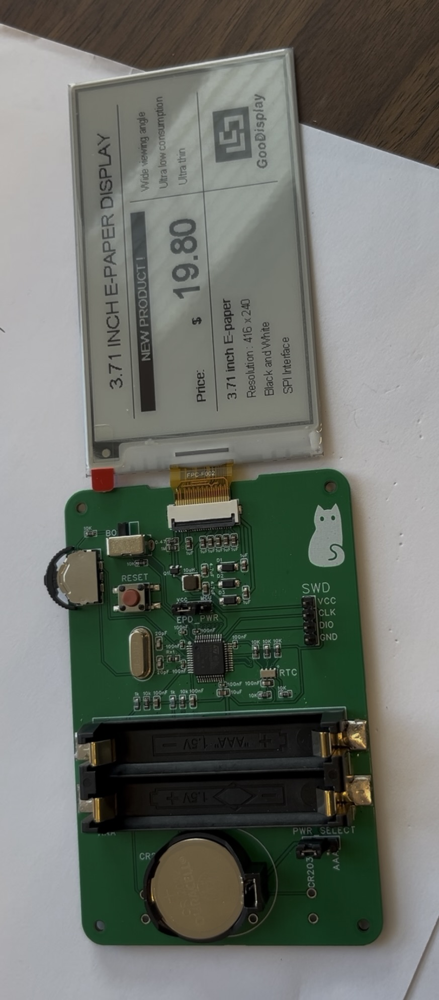

<div align="center"> 
  <h1> Ultra Low Power E-Ink Tracker </h1>
</div>

<table align="center" border="0">
  <tr>
    <td valign="middle">
      
    </td>
    <td valign="middle">
      
    </td>
  </tr>
</table>

# At a glance

**Technical:**

- Low power
  
  - STM32U0 used in shutdown mode, 
  
  - Ultra low power RTC
  
  - E-ink that is disconnected from power except for the brief moments when it's refreshed
  
  - Runs on CR2032 coin cell, ideally should last longer than the battery (10 years) but at least a few years

- Custom schematic + PCB

- Custom enclosure (3D printed)

**Most relevant skills demonstrated:** Embedded C, Schematic Capture, PCB Design, STM32 (CubeMX, CubeIDE)

**What is it/general description**

Cleaning tracker for the bathroom, displays bathroom was cleaned X days ago by Y. Two buttons, once for each person, resets the counter and displays the other persons name.

## Background

This project was made to learn and get a more in depth understanding of embedded sytems. I wanted to learn how to work with STM32 MCUs as I had only worked with Arduino and ESP32 on the Arduino IDE. I also wanted to choose all the components, make the schematic and PCB to learn or practice how to do all those things. With the goal of learning and not outcome, I made sure to write everything myself, and only lightly consulted AI when I felt I needed advice while double checking everything it said or to get a rough idea of something.

## Project structure

Most folders will have their own README to get more info. Here is a high level overview:

```
/u0-main-v1/            The main project code
    /MyDrivers          The drivers currently being used
    /Src/main.C         The main code
    Everything else     Auto generated by CubeMX

/PCB/                   PCB hardware files and anything related

/Enclosure/             The CAD files of the enclosure

/Projects/              All the other CubeIDE projects I made in this endeavour. For testing or learning.

/Components/            Info related to components (datasheets, manufacturer provided files)

/docs/                  Further documentation
    /daily-journal/     All the daily notes I wrote while working on this projects
    /general.md         Tidbits that I picked up along the way which are relevant to remember while working on this project
```

### Development Journal

Every day I worked on this project I documented what I did in a journal. This includes challenges/problems I faced, how I solved them, progress I made; including photos. They're useful to refer back to, to see why I made a certain decision or how I solved a problem I'm encoutering again. They are freeform to make them easy and quick to write.

## Design Decisions

- **Making a protoype** - I decided to make a prototype as a MVP to get a full and concrete idea of what the final version needs. As well as being able to start right away with the parts I have.

- **Main component selection** 
  
  - MCU: STM32U073CCT6. U0 line for ultra low power, U073CCT6 specifically as it has enough ram for screen buffer, form factor (pins and solderability), extra flash for peace of mind, availability
  
  - RTC: RV-3028-C7. Super low power
  
  - Screen: GDEY037T03. Good size and aspect ratio, black and white (less ram needed), price, availability, partial update capability, fast refresh 

## Progress

- [x] Prototype (with on hand components)
  
  - [x] Initial research to get an idea of what components will be used
  - [x] STM32 blinky tutorial
  - [x] STM32 UART tutorial
  - [x] STM32 I2C tutorial
  - [x] Communicate with RTC in any capacity
  - [x] STM32 Interrupt/ISR tutorial
  - [x] Set an alarm on the RTC to get an interrupt once a day
  - [x] STM32 SPI tutorial
  - [x] Solder dupont wires to screen connector
  - [x] Modify and configure manufacturer code to get anything on eink screen
  - [x] Get a basic UI on screen
  - [x] Wire up buttons with pull/down resistors and read signal
  - [x] Figure out hardware debouncing for buttons (MCUs have internal schmitt triggers and use RC circuit)
  - [x] Power using battery
  - [x] STM32 power/sleep tutorial
  - [x] Make MCU go into deep sleep and wake back up
  - [x] STM32 backup registers tutorial
  - [x] Make values persist between sleep (using backup registers)
  - [x] Make sure I can get which pin woke up the MCU
  - [x] Probe thumbwheel to figure out how it's connected internally

- [ ] Main V1
  
  - [x] Choose components
    
    - [x] Screen
    - [x] Boost converter components for screen
    - [x] MCU
    - [x] RTC
    - [x] Battery holders
    - [x] Header pins
    - [x] Passives
    - [x] Standoffs
    - [x] Thumbwheel
    - [x] Push buttons
    - [x] FPC connector
    - [x] Oscillator/clock
  
  - [x] Design schematic (read through the datasheets and figure out how to use each component/what to put on each pin)
    
    - [x] RTC (datasheet + calculations for I2C resistances)
    - [x] MCU and Oscillator (datasheets + design guide + reference manual + bootloader info + oscillator design guide)
    - [x] Screen (datasheet + reference schematics)
    - [x] Miscellaneous
  
  - [x] PCB design
    
    - [x] Board outline based on dimensions of screen + its connector and buttons and battery holder
    - [x] Lay out PCB
    - [x] Route everything
    - [x] Vias and pours/planes
    - [x] DRC
    - [x] Annotations
  
  - [x] Assembly
    
    - [x] Export design files
    - [x] Order PCB + stencil
    - [x] Order components
    - [x] Assemble: solder paste + component placement + reflow
  
  - [x] Testing
    
    - [x] Test new screen with existing dev board
    - [x] Communicate with MCU, flash anything
    - [x] Communicate with RTC, get real data
    - [x] Configure using external oscillator, check using HSERDY flag/bit
    - [x] Make screen display anything
    - [x] Flip coin cell holder because schematic symbol was wrong
    - [x] Run on everything coin cell
  
  - [x] Enclosure
    
    - [x] CAD
    - [x] 3D print
    - [x] Check
    - [x] Repeat until it works
  
  - [ ] Firmware (read through datasheet and get everything working like it should in the final version)
    
    - [ ] RTC
      - [ ] Settings/config (for example: disable clkout)
      - [x] Set the time
      - [ ] Setup alarm + handle interrupt
      - [ ] Save setting using EEPROM
    - [ ] Power/sleep for MCU
      - [x] Go to shutdown mode and confirm by measuring current
      - [ ] Figure out why it doesn't stay asleep for the right amount of time when interrupting with RTC
    - [ ] Screen
      - [ ] Rewrite the drivers
    - [ ] General (buttons, thumbswitch)

## 

## Getting started (Build & Flash)

For anyone picking this project up, including future me.

1. **Toolchain:** STM32CubeIDE 2.0.0

2. **Hardware setup:** ST-LINK V2 (blue USB), ST-LINK <-> PCB: SWCLK <-> CLK, SWDIO <-> DIO, VCC <-> VCC, GND <-> GND

3. **Build and flash:** Default build and flash settings in CubeIDE

4. **First boot:** Set the time

To update when known: 

- Might need to flash firmware to configure RTC and save to its eeprom, then flash final firmware

- Steps to set the time

More image (pcb digital)
