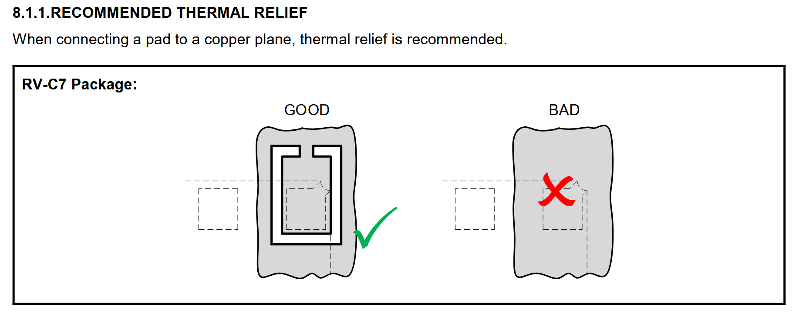
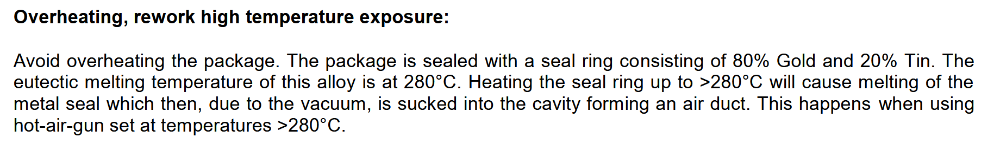
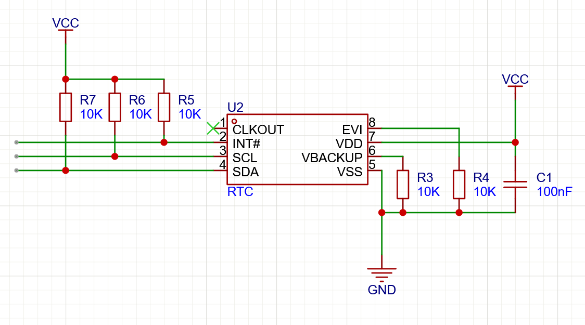
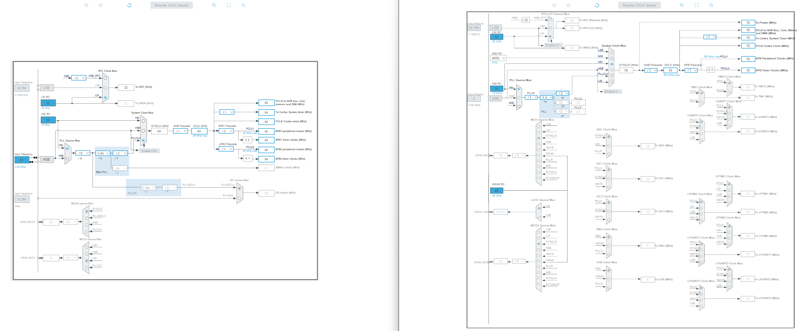

Continuing with the RTC. When an interrupt is sent it pulls !INT low and keeps it low until the flag is cleared. pg 58

To use alarm need to set AIE bit in control 2 register to 1. AF flag goes high at an interrupt. (pg 68) Will view more later. Not needed for component selection. 

I don't need anything from the external even interrupt, its used to do something in the clock when an external event happens.

I2C 7 bit address: 0b1010010

At this point I think I know all the components I need for it. But they did not specify if I could leave clkout floating and to what level I should tie evi to. Searching it up you can leave output pins such as clkout "floating" as they will drive themselves. And I read up on the use of the evi pin and it registers an event when driven high so ill just tie it to gnd.

Looking at their demo board to ensure I have everything right I noticed a tiny decoupling cap between gnd and vcc. With this I also realized they had a typical application section which describes how the rtc should be wired in certain use cases, very handy. I had most things right but they use a 10k resistor to pull EVI to gnd in case you need it for testing in the future. So you could pull it high. And they have a 100nF decoupling cap between gnd and vcc which they emphasize should be close to the device. I was going to disable everything not needed but they also mention it, disable clkout to minimize power consumption. They also use 10k resistors for the pull ups, this is in the range i calculated, seems good, will use the same.

This is not the first time I encouter these decoupling caps so I will research there use. It seems like there is lots to read but in practice it isn't that complex, as we've seen its just adding a capacitor close to the pins and there are standard values. Sometimes we might use more than one cap and more than one type. They are used to filter out high frequency noise as well as provide power for spikes. When quickly switching from low to high in an IC it will create a current spike the capacitor can deliver that, bypassing the power supply. They should be placed very close to the pins to reduce parasitic inductance (inductance that comes from just existing, not deliberately added) as it resists changes in current, counteracting the effects of the capacitor.

With this I made the schematic for the RTC. Just to make sure everything is in place, I need to learn the best practices for making a schematic then making the proper version. 

Hard to find low profile headers then I realized i can't have any through hole parts so that would be even harder to find. So I just used smd right angle headers. These will work with normal jumpers. https://www.lcsc.com/product-detail/C5371819.html https://www.lcsc.com/product-detail/C46061677.html
I will buy a big strip then cut to however many i want (from taobao).

Time for component selection for the MCU, guh. 

"The content of SRAM2 is retained in Standby mode"

Not using vdda -> tie to gnd (page 10)

Questions: what pin to put battery voltage into for mcu? Do i need to do anything on the battery to use the power, like regulate it or diode?

On wake up uses internal 4mhz clock, need to reconfigure clock on wakeup if need higher frequency.

It seems you can only use an internal clock with the u0. On page 16 they list the possible clock sources and they're all internal. Comparing the clock config between the f1 and u0 we can see there is no place to input an external clock:  Makes it easier for me :). But would've been good experience.

Notes: research CRS as I might be able to include an external clock using that, use the spi bus that has dma so i can expirement with it, breakout uart for debugging maybe

Note to self: buy jumpers https://www.lcsc.com/product-detail/C5305.html