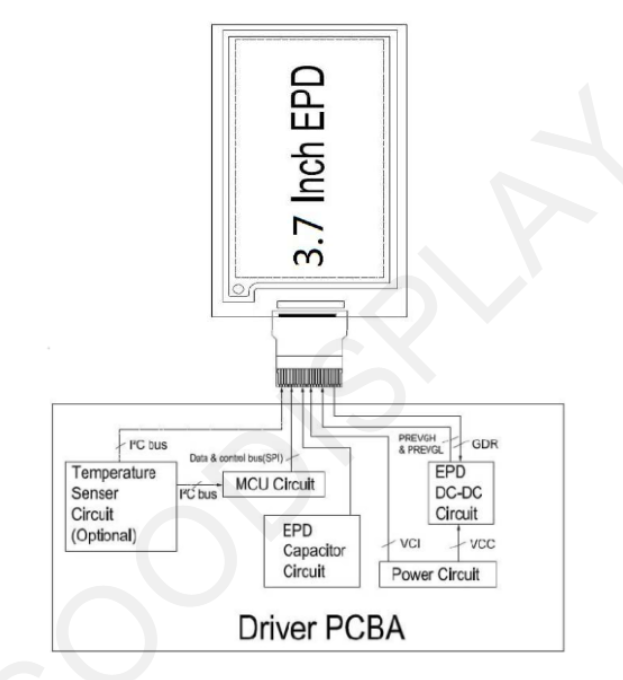
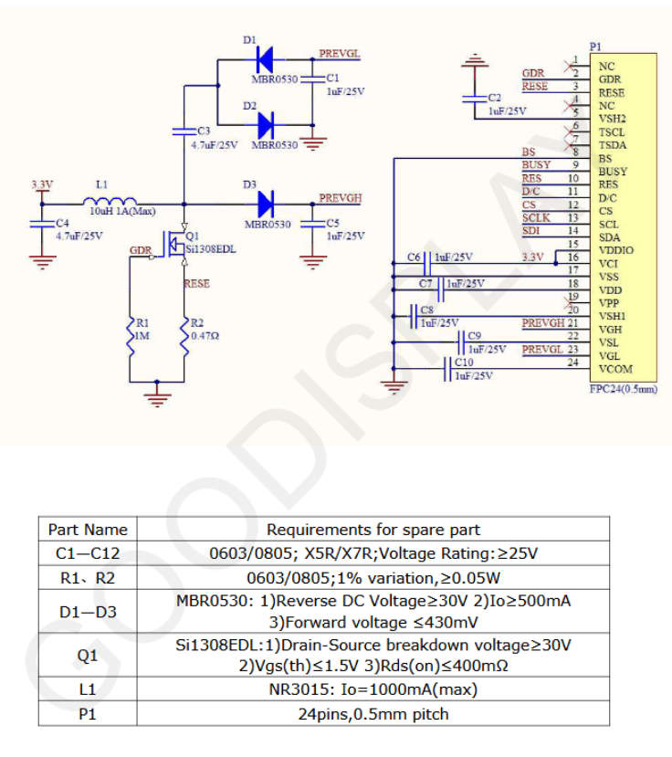
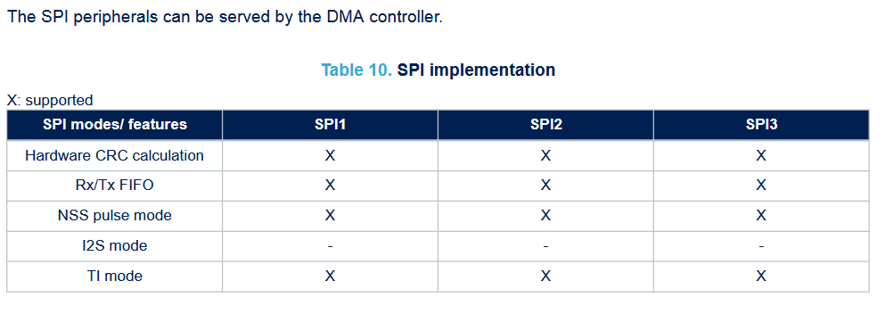
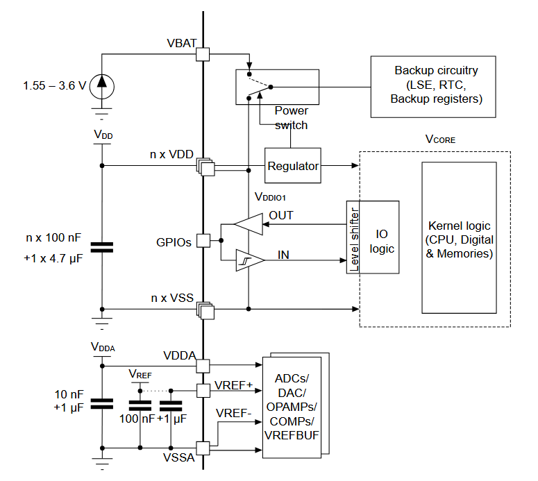
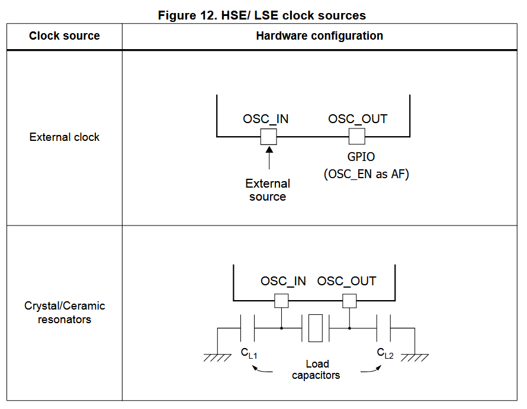
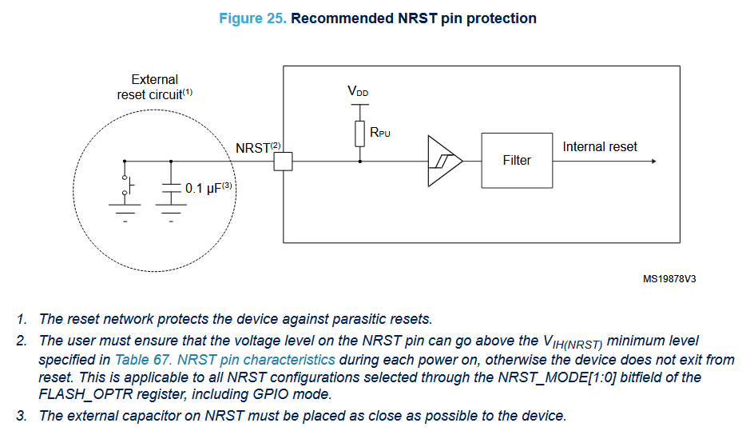
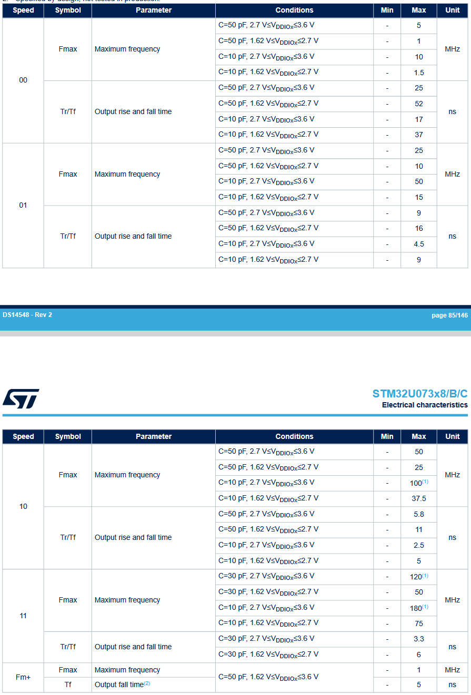
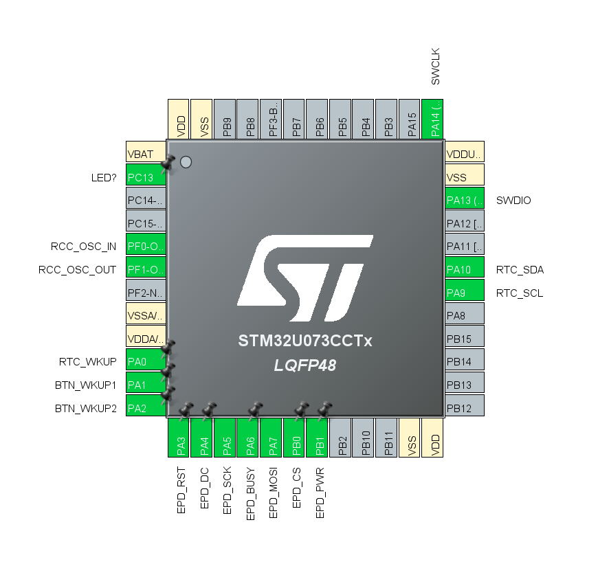

continuing with mcu datasheet reading. was looking at spi and it said max speed of 32Mbits/s so i was curious what the max for the screen was. Found block diagram and specs for the driver which will be very helpful  . It was in the driver datasheet, 20Mhz. All the spi buses can use dma and have the same specs (page 25): 

"Each power supply pair (such as VDD/VSS, VDDA/VSSA) must be decoupled with filtering ceramic capacitors as
shown above. These capacitors must be placed as close as possible to, or below, the appropriate pins on the
underside of the PCB to ensure the good functionality of the device" page 42. 

I'm quite lost on the power and clock atm. I've realized you actually can have external clocks, i just didn't see them as they were greyed out since i didnt enable them. There is a low speed and high speed one. But you can configure RCC (reset and clock control) for crystal/ceramic oscillator or bypass. And I didn't really know which to use. Googling it, one is for an oscillator and the other for a resonator but i was still confused and I found the reference manual which should explain more. There is a system clock that drives the processor, it is derived from the low/high speed internal/external clocks. Then that is divided by 1-512 to get HCLK, the high speed clock used for most other things. That is divided by 1-16 for the PCLK, the peripheral clock. There is also HCLK8 which is just HCLK/8. Ok I understand, the crystal/ceramic oscillator mode is so you connect the crystal to two pins of the mcu and it will provide the power so it actually resonates. In bypass mode it disables that control circuitry and you just give it the oscillations on a pin, so you would be driving/controlling the oscillator (page 158). I will let the mcu handle it. An external oscillator is more accurate but probably isn't necessary for my application. I will still use it even it uses more power and costs more simply for the experience of design. . So i need a oscillator and "load capactitors" and maybe a resistor i need to figure out what those are and what value i need. "The resonator and the load capacitors have to be placed as close as possible to the oscillator pins in order to minimize output distortion and startup stabilization time."  "The main regulator output voltage (V CORE ) can be programmed by software to two different power ranges (Range 1 and Range 2) in order to optimize the consumption depending on the system’s maximum operating frequency (refer to Section 5.2.9: Clock source frequency versus voltage scaling " page 108, ref man. To know specs for the oscillator check page 72 of datasheet

While looking at the power section I started wondering about the minimum voltage for the eink. While my cr2032 starts at 3.3v it will get lower and I don't know if thats suitable. Luckily I accidentaly discharged one so its at 2.9v, the eink did work but the colors weren't right and there were some strips of different colors, and it dropped a bit below 2.7v during operation. But on the gooddisplay website (https://www.good-display.com/faq/1.html) they state a minimum of 2.3v but realistically 2.5v, that should be fine. I'm just going to hope that since mine is multi colour and from waveshare that it has different specs. Trying a fresh battery it had similar results also dropping close to 2.7v. It seems the current draw is too much and the internal resistance is pulling it quite low. This screen does draw almost 4x the current of the new one and for much longer. It works fine with two AAA batteries. I will take this into consideration and make a way to connect two AAA or a cr2032.

For reset pin: (page 87, datashet) 

I will not use a diode on the battery circuitry since the voltage is low enough already. I'll just make sure to plug it in the right way round. "All main power (VDD, VDDA, VDDUSB, VBAT) and ground (VSS, VSSA) pins must always be connected to the external power supplies, in the permitted range" page 44 datasheet. Need bulk 4.7uF cap on mcu? need 10uF on mcu for startup? The cr2032 has continous current draw rated at 0.2mA. Screen requires 6ma but for short bursts of 1-2s for refresh it should be ok. The aaa is a backup anyway and ive tested those.

I need to see how the boot pins should be. The u073 line uses pattern 11 for the bootloader, nevermind whatever not for now just needs resistors for pull up or down. 

My beloved stm32 provides hardware guides, just 26 pages lfg. This video is also helpful https://www.youtube.com/watch?v=aVUqaB0IMh4.

In summary:
- 100 nF cap for each Vdd line
- Tie all vdd lines together as they need to be connected to a power supply
- 10 uF bulk cap to provide quick power when needed like startup (next project or later research how they got this value), use ceramic for low esr (what is esr?)
- Crystal oscillator + two loading caps right next to the rcc pins (+ resistor?)
- Switch for boot pin with pull up/down resistor
- 3.3v, swdio, swclk, gnd for programming to headers
- connect i2c to rtc
- connect spi to eink
- connect wakeup pins to buttons (pull up or down?) and rtc
- all vss pins to gnd
- nrst 100nF + gnd switch
- battery straight to 3.3V of mcu
- large cap at eink?
- vdd for mcu and rtc straight from battery
- spi power from mcu pin so it turns off when necessary
- jumper to select cr2032 or aaa
- rc circuits for button debouncing

Multiple sources saying no serial wire:
https://community.st.com/t5/stm32cubemx-mcus/stm32u073-swo-debug-not-available/td-p/849154
https://community.st.com/t5/stm32-mcus-boards-and-hardware/how-to-enable-serial-wire-view-in-stm32u031r8-controller/td-p/714083
But all the datasheets say there is. Apparently there is a SWO pin which they are referring to. But the board still has the noral swdio and swclk for programming.

The video has cleared a few things up or at least confirmed what i suspected. To get a more complete picture im now configuring the mcu in cubemx. This reminded me that i need to pull high when the button is pressed as it wakes the mcu. Confused about "maximum output speed" it doesn't seem to be explicitly mentioned anywhere, this is useful: https://electronics.stackexchange.com/questions/438556/how-to-choose-uart-maximum-output-speed. For my chip: \ It will operate at at least 2.7V so we can see the low speed mode can handle 5-10 mhz depending on the line capacitance. It is very easy to change between speed modes so I can simply check the capacitance after I layout the board and select the proper speed. A lower speed means less power used as it does't need to rise the signal so quickly so not spike the current as much. It will be something to keep in mind to maybe keep the spi lines close to the mcu as i will use them the most. I2C will only be used for maintenance so just setup. Here is what I have so far, I still need to configure for the thumbwheel switch and i'm unsure what leds i want the rest should be good: 

Also I've realized the rtc interrupt is active low so I might need an inverter to wakeup the mcu as it needs a high signal. If it pulses low the high is should be fine but I don't think it does that. I will leave a place for an inverter and a place for a 0 ohm resistor or sodler bridge to bypass it if needed.

Note: reconfigure SPI prescaler after setting up clock (remember max 20mhz)