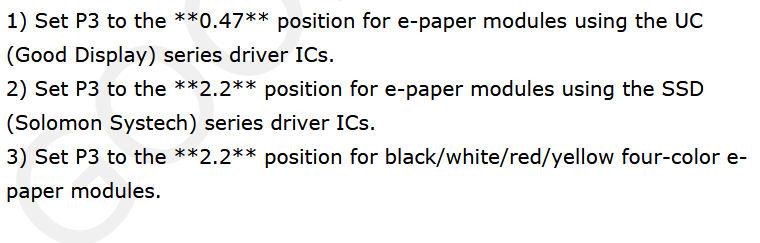
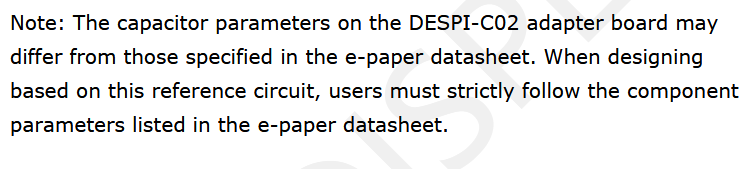
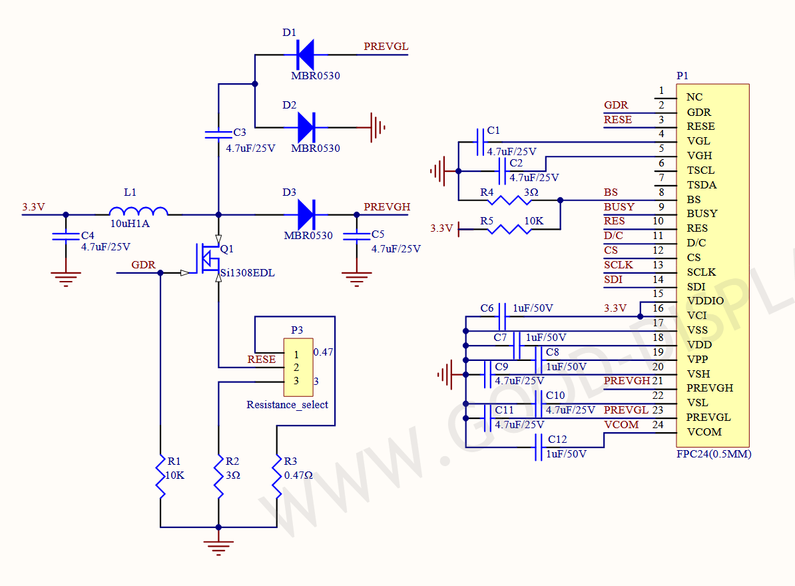
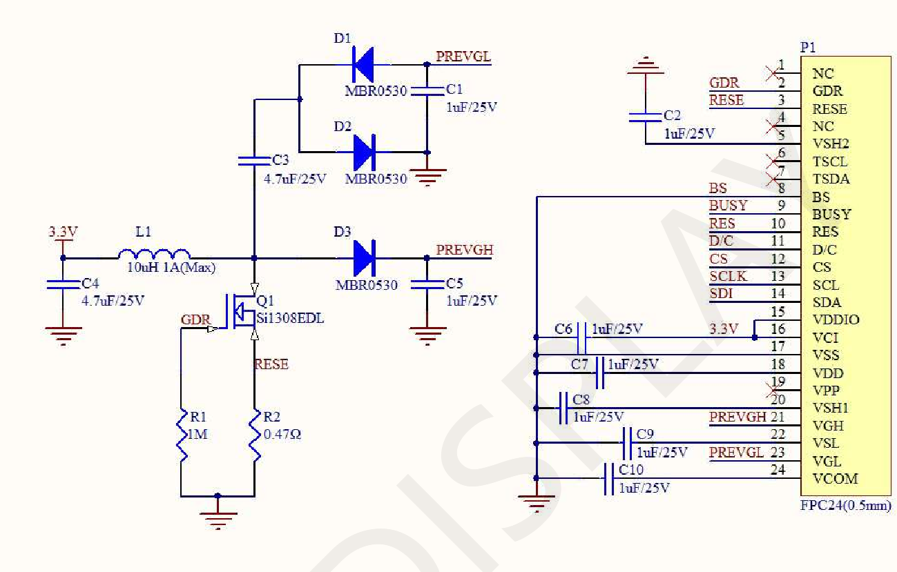
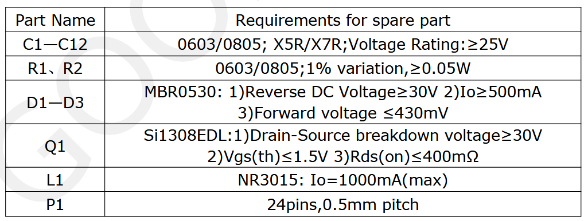
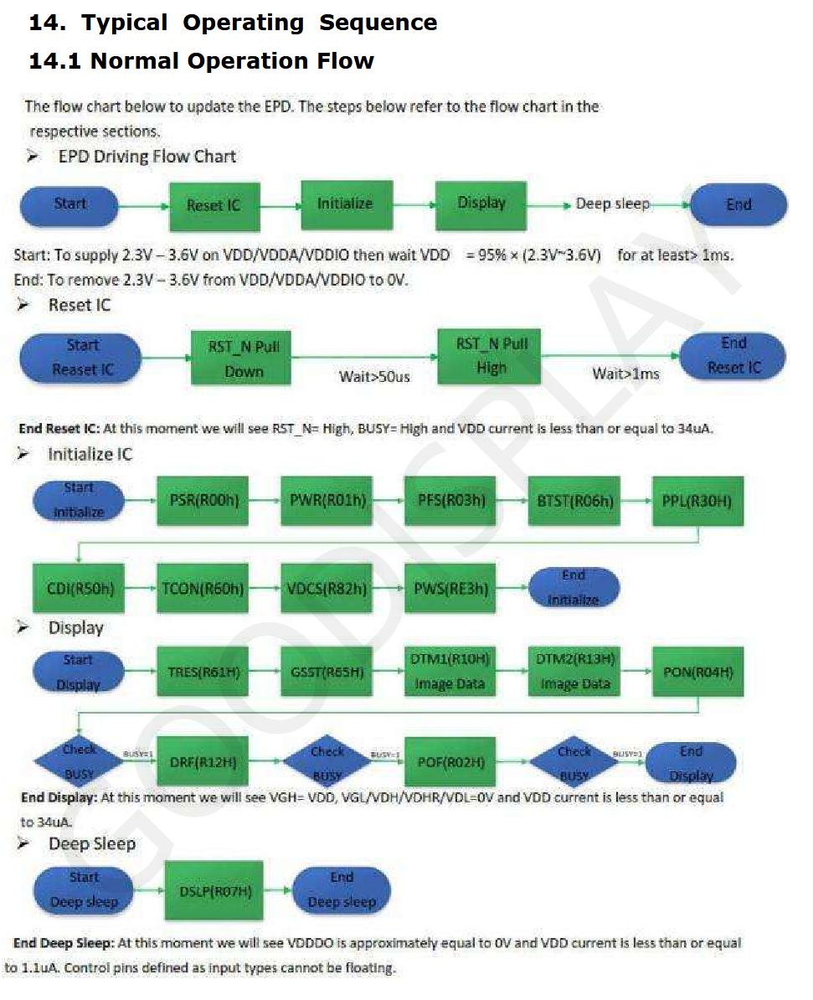
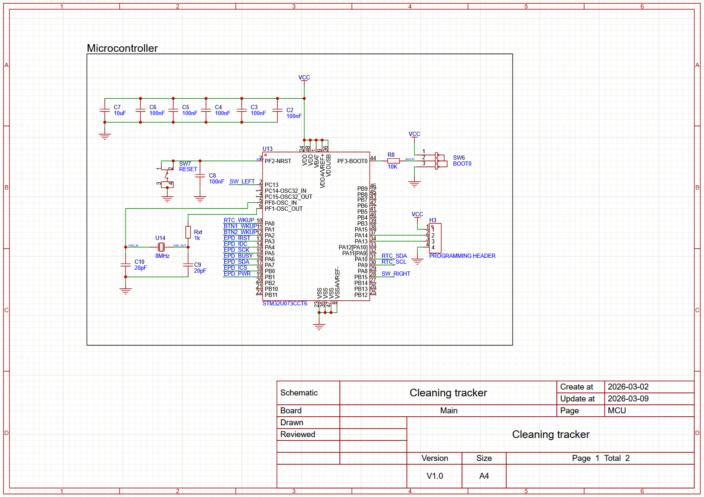
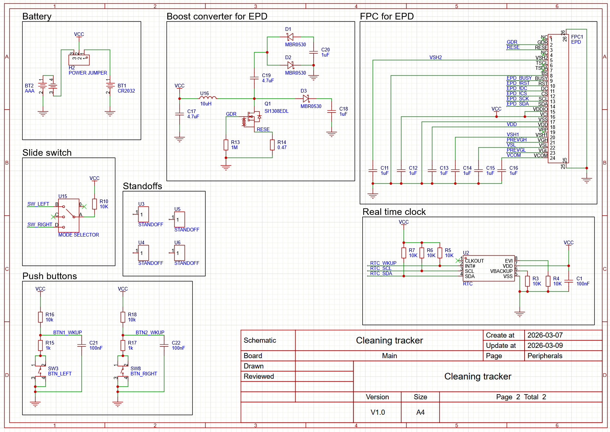

searched for the pdfs on https://www.good-display.com/companyfile/5/#c_portalResCompanyFile_list-15878877704403956-2. because the buy site doesn't have downloadable links.

now to go through eink + driver + ic datasheet.  the eink i chose uses the UC8253, so instead of putting a switch ill just use a 0.47 ohm resistor directly. The UC driver needs a 10uH 1A shielded inductor as per their recommendation. MOSFET can be Si1304BDL or Si1308EDL or AO3400. MBR0530 is the shotcky diode to use. 24 pin 0.5mm pitch fpc connector, i used double sided for no guessing which way it goes in.  Will check the other datasheet. The pins from the generic driver do not line up with the eink, but they provide a schematic specifically for the eink, thank god.  , it also has the proper caps. They also list the component requirements . They also provide a block diagram so I can understand what each part does . And those random sequence of numbers from the previous eink's library are decoded here . Time to copy their schematic for component selection and worry more about how it works later as the deadline is today. I should also make a separate driver board for testing, just like im doing for the rtc. Used fan net to put all labels on FPC. Vdd is not connected to power, but its the main ic power, so i was confused. Reading the pinout it says "core logic power pin vdd can be regulted internally from vci. a capacitor should be connected between vdd and vss" so its simply routed internally. 

I remembered that I forgot to make an RC circuit for the buttons so I did that. Tried to make it pull high but it doesn't seem ideal. I really hope I can configure those pins to wakeup on low. Ok the schematic should basically be done now, and I checked what I have and replaced the components with what I have. I just need to replace the cr2032 battery holder, fpc, and check the inductor. Here it is so far:  