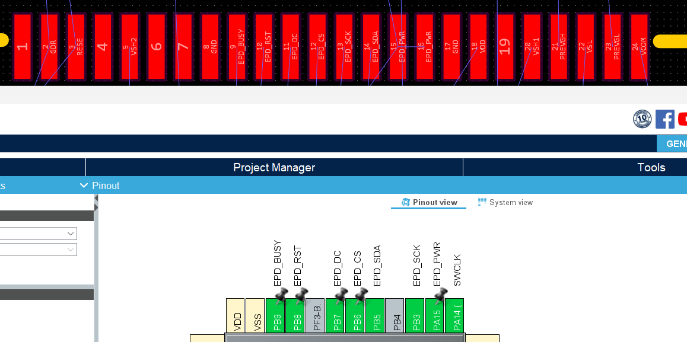
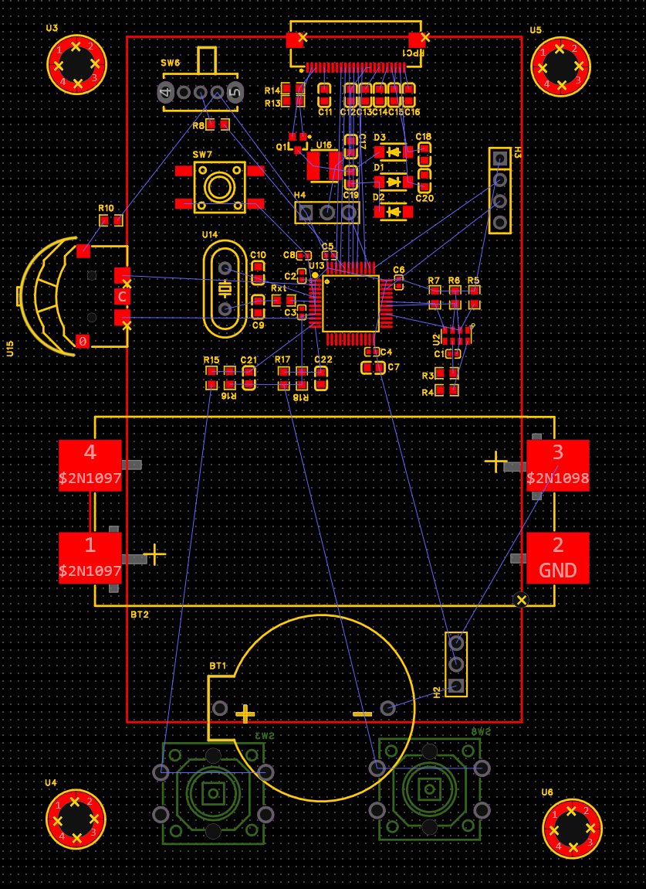

Kept the layout at the back of my mind. I have some ideas to rememdy yesterdy's issues. I've moved the EPD lines to the top of the MCU, this should make routing the RTC easier. This will make it so I connect the EPD from the top so the larger bezel with the silver embedded IC is at the top. I think this will lookup better as I can cover it up with the case and at the bottom I can keep it open where it will sit next to the buttons. I can moving the EPD pinout to allign with the FPC best. This driver only has 8 lines as compared to the 9 of the previous EPD, but this is because it only has one power line instead of power and 3.3v. I will drive it from the MCU to be able to the eink off entirely. I'm not entirely sure about this decision so I think ill add a jumper to choose mcu or 3.3v. I've lined up the mcu pinout and fpc pinout as close as I can:  I can also make the RTC wkup pin much closer to the i2c pins.

I hide the GND ratline as its everywhere and messy and I can easily get it from the gnd plane. I hide all the ratlines and only show the relevant ones for the section to make it easier to understand whats going on.

I added the outline of the screen to get a feel for size. It seems the AAA battery holder is going to make the PCB wider. I finished the rev 1 rough layout: 