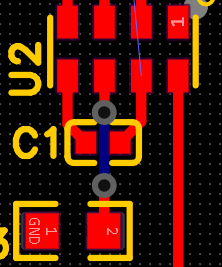
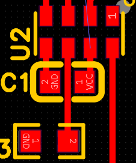
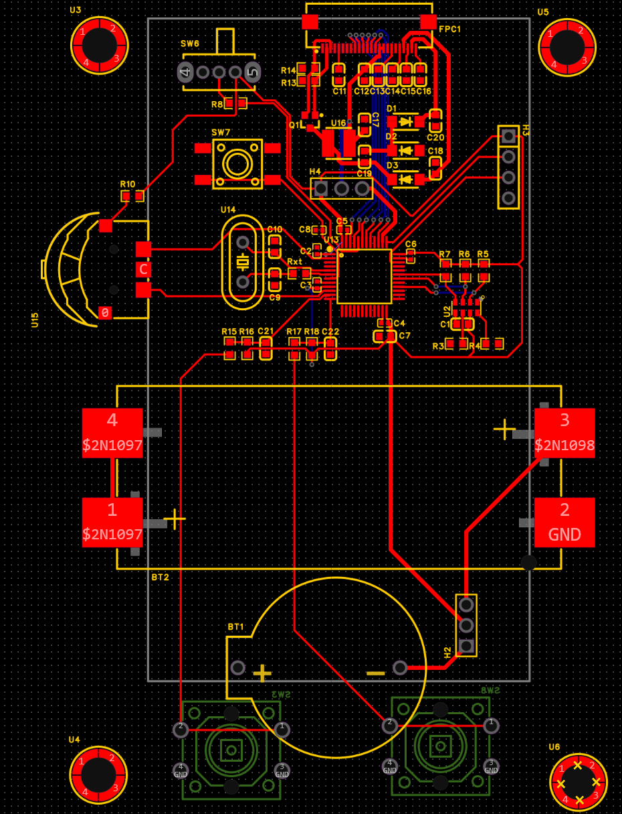

Now doing the routing. Pretty easy because I thought of it while laying out. There doesn't seem to be any other way than using vias for the epd signal lines and the driver board seems to do the same. Although everything is low power I enlarged the traces for the power of the EPD as it has higher voltage and the driver board does the same. For the RTC i had originally thought I needed a via to have the bypass cap as close as possible and still connect everything as seen: . But after referencing the demo board I realised they routed it unnder the cap as they used a larger one then me. I will do the same, use 0603 instead of 0402. After: 

Heres how it looks after being routed (without gnd as i havent made the gnd plane yet): 

I still need to make the gnd plane and add vias for the gnd pins. And get the dimensions to make the cutout and to align the buttons and mounting holes.