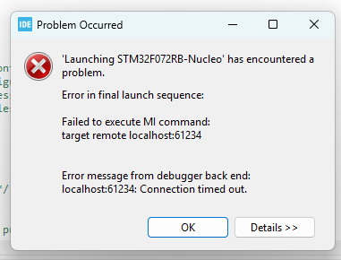
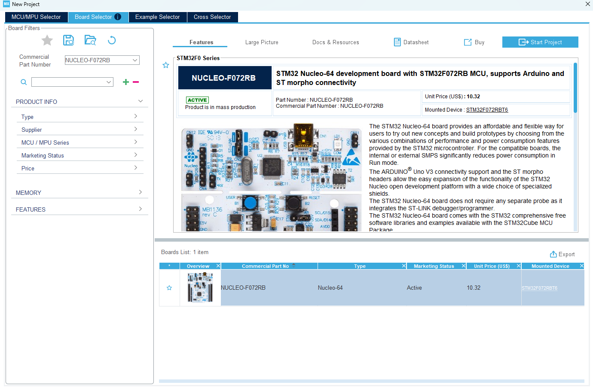
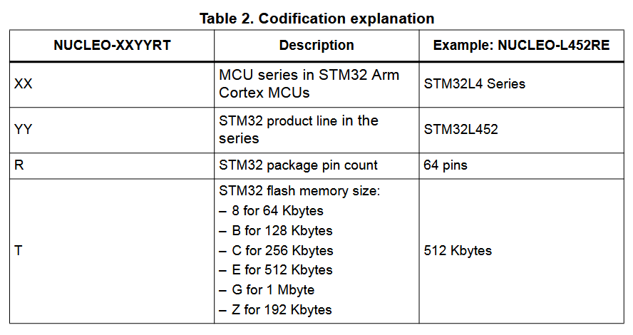
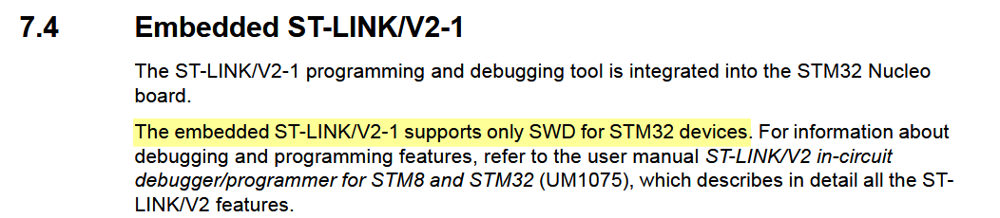
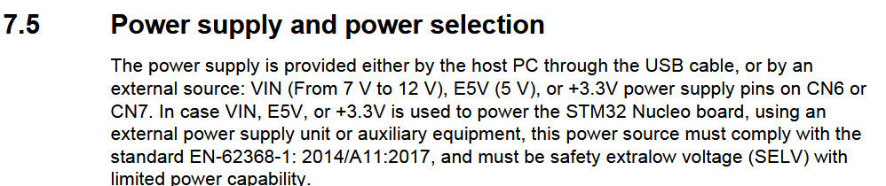
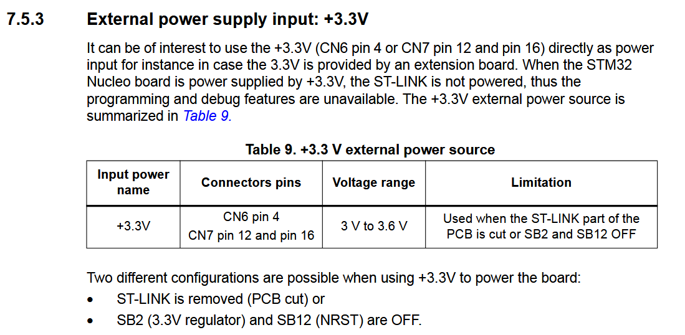
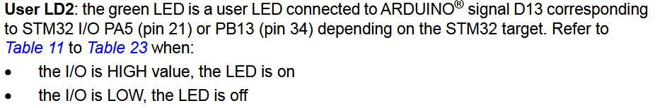
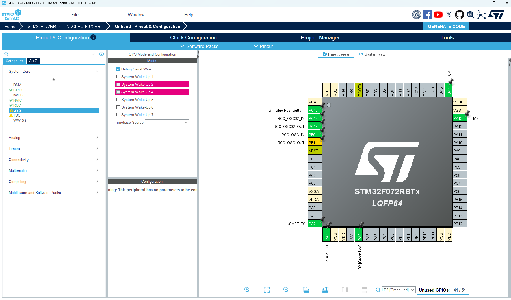
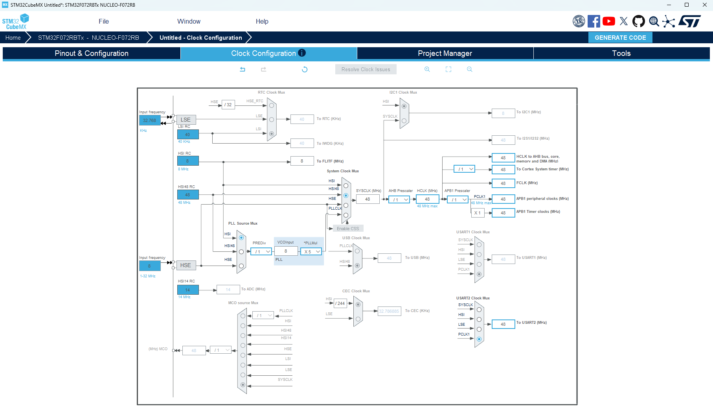
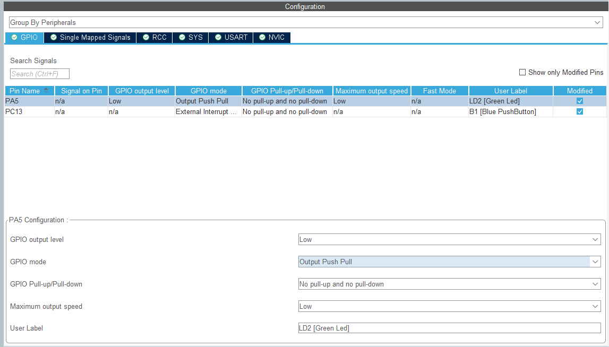

filmed the comopnent selection for prototype

time to get started learning to use stm32
search up "getting started with stm32"
first doing https://wiki.st.com/stm32mcu/wiki/Category:Getting_started_with_STM32_:_STM32_step_by_step

starts off with the basics https://wiki.st.com/stm32mcu/wiki/STM32StepByStep:STM32MCU_basics\
maybe i can explain what an mcu is here.

went through https://wiki.st.com/stm32mcu/wiki/STM32StepByStep:Step1_Tools_installation\
took some time to install

stayed on cubemx for step 5 instead of opening cubeide

finally get it open and it keeps failing. and says no recent launches. restart the program. now it fails to start gdb server. trying to do the most basic thing with their newest tools and their example code. how awfull. works with a different debugger version. but i want to be able to use all the features and especially run.

coming back to it a bit later and plugging it in. it just blinks. and being told this is a genuine board im going to try and update the firmware again. or else ill try a clone. it just works now??? great! but i was informed that this board probably doesn't have enough memory for the eink. i will still continue and to confirm that it is true.

ok time for step 2. https://wiki.st.com/stm32mcu/wiki/STM32StepByStep:Step2_Blink_LED\
linked is a 2600 page pdf for HAL, guh https://www.st.com/content/ccc/resource/technical/document/user_manual/63/a8/8f/e3/ca/a1/4c/84/DM00173145.pdf/files/DM00173145.pdf/jcr:content/translations/en.DM00173145.pdf\
starting a new project in MX

to get to know what pins can be used for what for my board they linked multiple resources. i looked at this one: https://www.st.com/content/ccc/resource/technical/document/user_manual/98/2e/fa/4b/e0/82/43/b7/DM00105823.pdf/files/DM00105823.pdf/jcr:content/translations/en.DM00105823.pdf\
and from there i learnt how they name the boards: \
but more importantly why the debugging wasnt working. from reading before i learnt that jtag is a more advanced debugging protocol so when i went to configure my debugger I was like yeah I want better debugging so i switched to it. as it turns out the nucleo boards only support debugging through serial and by restarting the ide or by updating the firmware it reset the debugger back to that setting and it worked. 
To power with battery: , more info in section 7.5.3: \
Given this it would make sense that CN7-12, CN7-16, CN6-4 are all connected. And using a multimeter to check, they are.\
From section 7.6 I found the pin I was looking for. The led LD2 is connected through pin PA5: \
With that I could make sure the config of the project was good. I can search the configured pinout on the bottom right. \
Now for the clock config, this is the confusing part that scared me the most last time. They tell me to use the PLLCLK for the system clock, however the default is HSI48. With some googling HSI is a high speed internal clock with a set frequency. I have one 8MHz and one 48MHz which is HSI48. PLLCLK is a generated signal so I can change it to something like 40MHz if needed. Either seems fine for now. \
Checked out the pin config: \
Then time to generate the code: video\
It seems you prep the project in CubeMX then edit in CubeIDE.

Usefull info to reference:
7.6 LED color meaning for debugger
