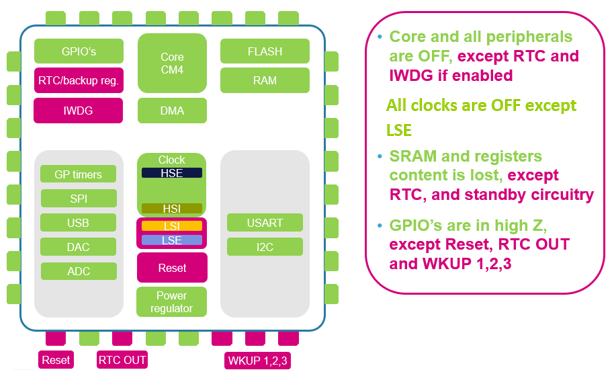

I need to save how long since the last cleaning and by who while in shutdown mode. Looking at the diagram: 
Using the backup registers seems most suitable. I can use one for the days since last cleaning and another as a boolean of who cleaned.
Using: https://community.st.com/t5/stm32-mcus/how-to-use-the-stm32-s-backup-registers/ta-p/49892\

I'm still having issues flashing the board. Online it says to connect the boot0 pin to 3.3v and toggle nrst to gnd which i can do using the button. It seems to have worked, i need to look into why it works if it keeps working. I also wanna know why i can short the pin straight to 3.3v. I used a dupont for that.

I used the new battery holder with the final battery to be used and it works great.

Here is the code:

```
	HAL_PWR_EnableWakeUpPin(PWR_WAKEUP_PIN1);
	HAL_GPIO_TogglePin(LED_GPIO_Port, LED_Pin);
	HAL_Delay(1000);
	HAL_GPIO_TogglePin(LED_GPIO_Port, LED_Pin);
	HAL_Delay(1000);

  /* USER CODE END 2 */

  /* Infinite loop */
  /* USER CODE BEGIN WHILE */
  while (1)
  {
	//check value in backup register, only write to it if we don't have our data in there already
	if(HAL_RTCEx_BKUPRead(&hrtc, RTC_BKP_DR1) != 0xCAFE){
		//enable access, write, disable access
		HAL_PWR_EnableBkUpAccess();
		HAL_RTCEx_BKUPWrite(&hrtc, RTC_BKP_DR1, 0xCAFE);
		HAL_PWR_DisableBkUpAccess();

		//data written, signal with 1 blink
		HAL_GPIO_TogglePin(LED_GPIO_Port, LED_Pin);
		HAL_Delay(400);
		HAL_GPIO_TogglePin(LED_GPIO_Port, LED_Pin);
		HAL_Delay(400);
	}else{
		//good data already in there, signal using 2 blinks
		HAL_GPIO_TogglePin(LED_GPIO_Port, LED_Pin);
		HAL_Delay(400);
		HAL_GPIO_TogglePin(LED_GPIO_Port, LED_Pin);
		HAL_Delay(400);
		HAL_GPIO_TogglePin(LED_GPIO_Port, LED_Pin);
		HAL_Delay(400);
		HAL_GPIO_TogglePin(LED_GPIO_Port, LED_Pin);
		HAL_Delay(400);
	}
	__HAL_PWR_CLEAR_FLAG(PWR_FLAG_WU);
	HAL_PWR_EnterSTANDBYMode();
  }
```

As before I enable wakeup from pin a0. I blink one to indicate it woke up. Then in the while i access backup register 1 and write to it if it doesnt contain the correct value or skip. 1 blink for write, 2 for skip. I clear the enable flag after this as it was waking up multiple times with just one touch of the pin. We also have to do "__HAL_RCC_PWR_CLK_ENABLE();" but that is automatically generarted as part of the system clock config.

Next time: figure out boot0 and nsp pin, what is a bootloader, what do the power flags mean
