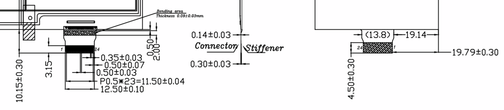
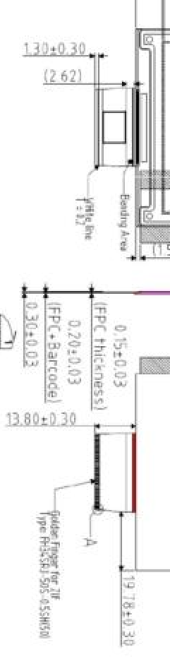
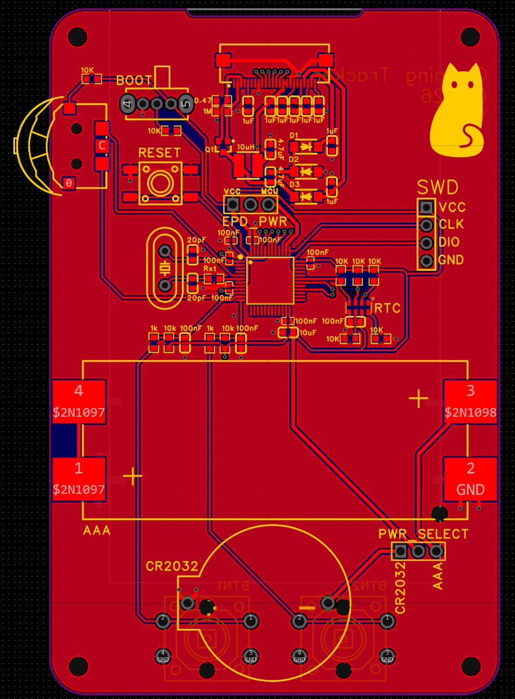
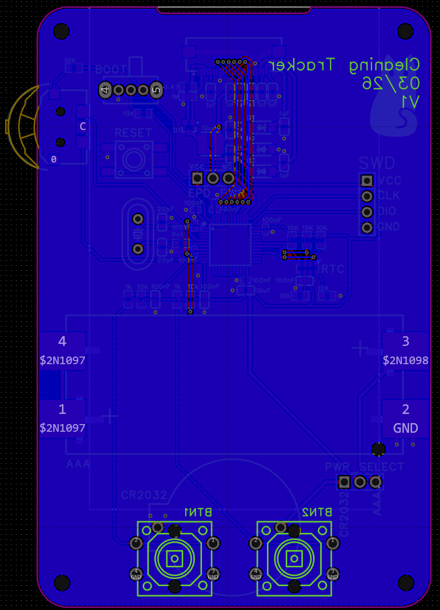

- TODO: dimensions of PCB + gnd plane + double check
- 
	- need to place the clip in the right place so the cable can go in properly without slack
	- (add images of current eink connector from phone)
	- I can use the 2mm bendy part to bend around to the back, to the pcb. Then to fully use the cable i would need place the connector (10.15-2-3.15) mm away from the edge. I like how the current eink has a cutout, it will help if i need a little extra length so i will do the same.
	- To confirm that was the correct approach I consulted the old eink dimensions
		- {:height 776, :width 164}
		- It should be 13.8-2.62-1.3 = 9.88 mm. And i measure 9.7mm from the edge of the board (not cutout) and the start of the connector. So, yes.
- The minimum width I can make the PCB is dictated by the massive AAA battery holder, the height is dictated by the eink height + button width. I will make it as small as possible + some gap between buttons an eink
- Replaced smt standoffs with holes for the tht througholes i bought
- Finding the 3D models for the components missing one/having the wrong one
- Adding GND plane to top and bottom + adding vias to connect them
- As I was going to add the cutout for the FPC I realized its not in the middle and it definitely needs to be so I moved everything left. Then I added the cutout which was a headache until I learned about "Dispersed as Independent Line" which detaches all the lines of the PCB border so I could merge it with the cutout border.
- I also changed all the names to the values of the components for easier assembly and labelled  everything.
- Here is the progress
	- {:height 520, :width 400}
	- {:height 726, :width 398}
	-