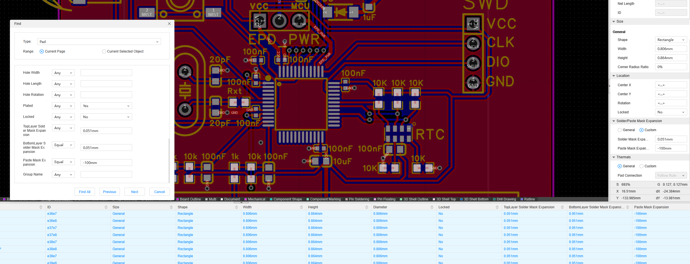

- Checking over all the pinout and schematic
- Mentally walk through having it arrive, plugging everything in and communicating with it
- Overall looks good, just changed spacing between the buttons
- 
	- There were notches in some of the resistors for the solder mask layer and jlcpcb said to check the mask and solder paste layer were the same or else they will ask you what you want to do and there will be delays. So i'm fixing this
- Ordered pcb from jlcpcb + stencil $9.11 usd
- Chose green for fastest turnaround, but wanted black