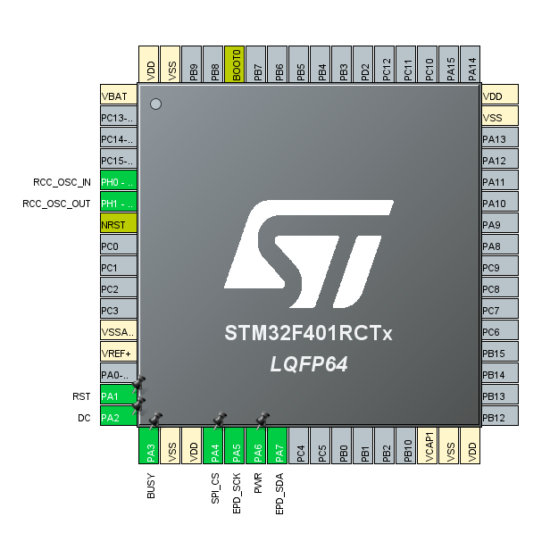
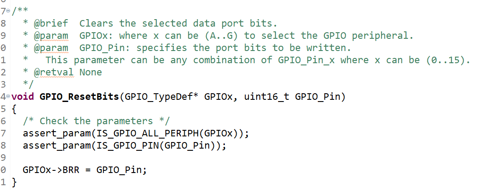
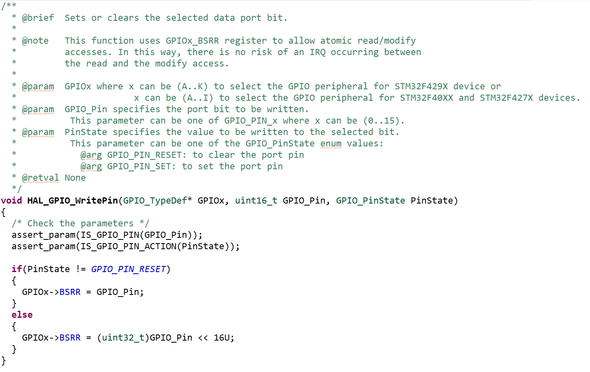

- Going to test the new eink on the blacpill
- Configuring the pins on blackpill for it
	- {:height 368, :width 386}
-
-
- Set driver board to UC driver/0.47 ohm
- The back of the epaper is very intricate and cool looking, i haven't seen it before as its usually covered
- Connected fpc with pins up as shown in datasheet for driver
- Connecting driver pins to board
	- My standard:
	- red = pwr
	- black = gnd
	- data = white
	- clk = yellow
	- rst = green
	- cs = blue
- Then I downloaded the sample STM32 code as reference
	- since they use a different board and different ide i cant just hit upload. i just need to copy paste the files, include the paths, resolve the pins and...
	- I need add the path by selecting the project folder>properties>C/C++General>Paths and Symbols and under Includes add each library folder separately
	- I need to resolve the pins in Display_EPD_W21_spi.h so I will use the constants defined in main.h to get descriptive self updating names (need to include main.h in that file)
	- I will forego using the PWR pin for now as they dont seem to use one and just currently want to test the screen is intact from shipping, will connect to 3.3 directly instead
	- I need to resolve the includes that are for the board they used to direct to my board #include "stm32f10x.h" -> #include "stm32f4xx.h"
	- They have a "EPD_GPIO_Init" function which initializes the pins as I've done this in mxcube I will forgo calling it
	- Then I'll port their main.c to mine
	- Used grep to search for functions the IDE couldn't find a reference for and check what they do
	- Replaced delay_s(n) with HAL_Delay(1000*n)
	- Realize that my folders are marked as to be "excluded from build" for some reason so i get a linker error (function is not defined)
	- The library uses `GPIO_ResetBits` and `GPIO_SetBits` which are no longer being used and aren't even accesible in my new project, instead I can use ``HAL_GPIO_WritePi``n with `GPIO_PIN_RESET and `GPIO_PIN_SET. Same idea with `GPIO_ReadInputDataBit(GPIOE, GPIO_Pin_13)`
	  id:: 69cf692b-064f-41b8-9fbf-010c2bd4b3e5
		- They are essentially indentical
		- 
		- 
		- Now it compiles. I will flash with the screen disconnected in case the previous code could do something bad as in send wrong power codes and fry the screen
	- I don't see anything happening. Time to check voltages
		- Getting 0v on prevgl and 3.3v on prevgh they say here https://www.good-display.com/news/79.html that this is because of a wrongly chosen mosfet. this is their board...  but i do have spare ones i can try to solder on, for tmrw