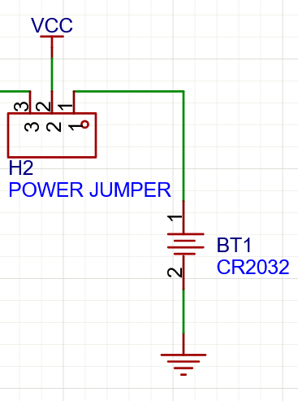
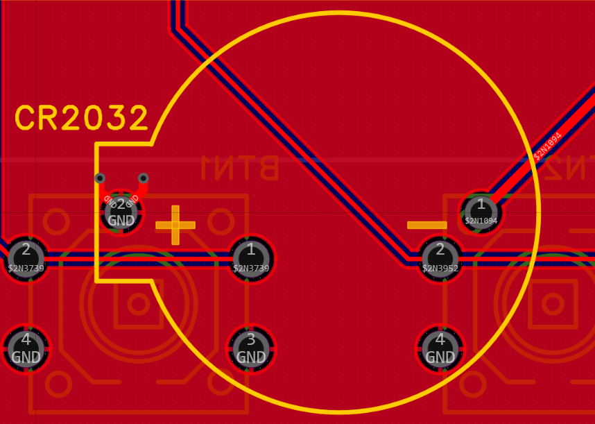

- Will test which battery to use
- Fresh CR2032 I get 3.285V. I will plug in with eink to see if it lights up. I can try again when I have the low power code but should give me an estimate
	- Put CR2032 in, use jumper to "select" it
	- I didnt do anything after 10s and after taking it out the battery was absolutely drained, only having 2.8V. I measured the current and it exceeded my multimeter mA port, over 3A, so I took it out right away. There is something seriously wrong
	- I plugged it in with the programmer and the screen is still working, phew
	- After some probing I realized I connected the battery holder pins in the wrong way. Because in the schematic symbol was wrong, the PCB silkscreen indicating +/- is right and they conflict.
		- {:height 297, :width 163}
		- The short side of the battery should be GND
		- {:height 236, :width 367}
		- But it corresponds with positive
		- Fix should be simple enough, just desolder, flip and resolder
		- I made sure I could measure 3V when connected as I wasn't getting right away
		- I measured current without the eink connected and it was 1.4mA so its reasonable
		- And now with the eink: Beautiful it works with the eink
		- I will measure the voltage with the oscilloscope throughout the whole procedure to see if the internal resistance is too high
			- The voltage spikes are very minimal, usually barely being able to be perceived on the oscilloscope
			- I will try at a more granular voltage step, if I switch to AC and 1x probe it will just show me how the voltage changes at 20mV division. I'd say about 60mV at most. When its on it seems there is a constant about 50mV noise probably due to the boost converter.
		- I will measure the current during the whole procedure to see how much extra current the eink uses
			- The current spikes are 1-4mA depending if its a full or partial refresh or flashing the screen
			- Disconnecting the eink entirely made close to no difference on the current maybe a few microamps but that could be noise fluctuation. Especially with my long wires. When in low power mode I will measure more precisely, this was more for a rough idea
			- I didnt measure using the oscilloscope and a shunt resistor as I didn't think the current spikes would be that short, and it doesnt look like they are
		- Very happy with the result especially considering that the battery is degraded and the MCU is drawing a lot more power than it needs to right now and the eink is absolutely perfect at this voltage
		- I measured the voltage at 2.987V at 11:34AM I want to see if it will drop when completely disconnected. I will keep the eink connected just in case