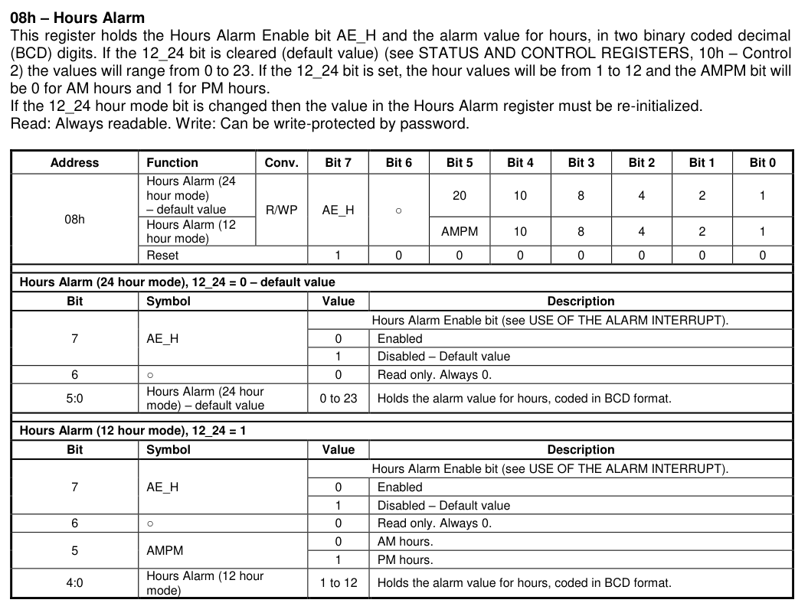
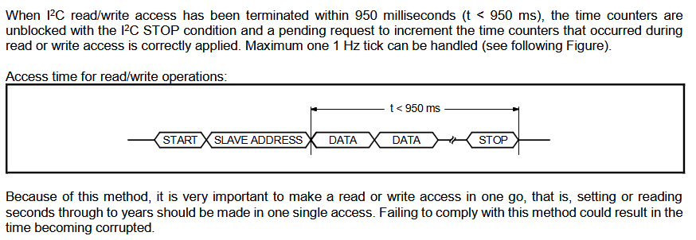

- going to get alarm working on the rtc
- {:height 355, :width 544}
- the control2 register holds the values i need. alarm is disabled by default and 24 hour mode is the default. i'll keep 24 hour mode and enable the alarm. then setup the hours alarm so it occurs once a day
- going to read seconds, minutes, hours first to see where they're at then set them to the right value
- then I will enable alarms in the control registers and enable the hours alarm on my current hour and see if it keep the interrupt high for the whole hour or what
- I remember reading that its better to set all the times at once so im looking through the datasheet again and now will make notes for the future
- "CLKOUT with a frequency of 32.768 kHz (*) is enabled by default (default value on delivery).
  If not used, disable CLKOUT to minimize current consumption (CLKOE = 0 and CLKF = 0, or FD = 111)"
- {:height 166, :width 601}
- I set the time by flashing the firmware with lines to set the time then flashing the same one with those lines commented out. If I debug and exit it restarts so flashes the old time. I realized I need to do this again when I'm going to run off battery so it doesn't matter much now. Also I have the side switch to adjust the time so it doesn't matter. In that case I will read the 7 registers and flash with the adjusted time that way I'm writing all in one go.
- I disabled the alarm but was confused as why the int pin was still low, but reading through I need to clear the alarm bit and that worked. Now I know how to work with the alarm
-
- Takeaway for the future:
	- Enable alarm interrupt in register 0x10
	- Clear the alarm status bit in register 0x0E
	- Write seconds-years all at once
	- Disable clkout