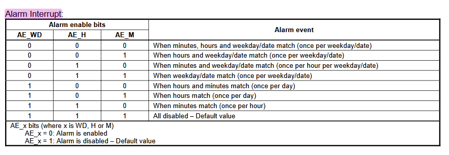

- removed the eink code to focus on the rtc
- will begin by handling the interrupt, so reset the alarm bit after it's been handled
	- first im wondering if i set an hour alarm and reset the alarm bit will it interrupt again if its still the same hour? and if i set up the minutes and hours alarm will it match both
	- gemini says both need to match. and the interrupt is triggered when the time initially happens so when i reset it, it wont keep going off, that seems sane
	- im going to setup the wakeup pin for the rtc as interrupt for now. when in run mode i will reconfigure all wakeup pins as interrupt pins
		- falling edge detection as its normally pulled high
		- no internal pull up/down since we have an external one
		- made sure to enable its interrupt in nvic
	- I was wondering why in the callback function it doesn't need the port number but it's because you can only have one pin with the same interrupt number. so if two pins could have exti3 you can only have one configured to do so
	- i'm only going to setup the hour interrupt since i just care when it goes to midnight
		- will it interrupt again next minute? will check
			- no need, i checked manually and i later read through the datasheet for alarm interrupt and it has an example just using the hour alarm, gemini hallucinating even on thinking mode
			- {:height 252, :width 619}
	- on interrupt it resets the AF bit
	- for the init, i enable the alarm, set the hour alarm to midnight, and disable clkout using fd
		- the RTC settings are based of RAM, the eeprom ones are for permanent storage and I don't care enough to use it. i can simply init it when needed
-
- takeaway:
	- need to reconfigure pins in run mode
	- how to run rtc init only on first boot/power cycle? does it matter?