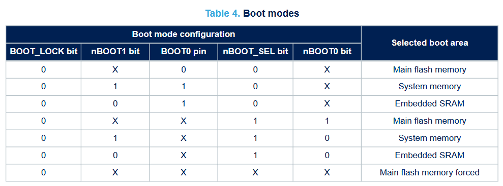
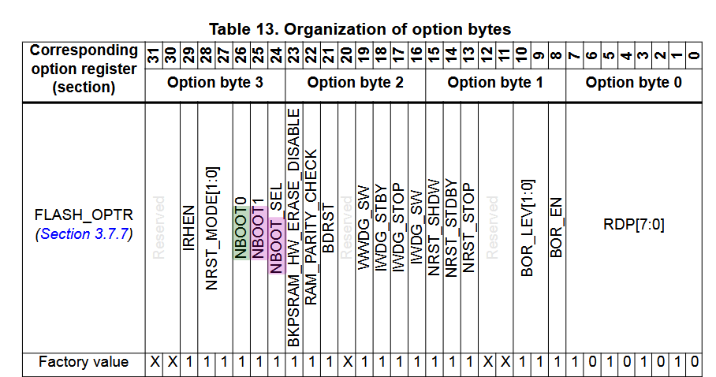

- Will get shutdown mode working. Will get rtc to wake up. Will reconfigure pins on wake.
	- will have a delay at the start so its easier to reprogram the mcu before it goes straight to bed
	- shutdown mode here uses PWR instead of PWRex function name, whatever
	- programmed it and ammeter shows 1uA or less even at the start, a little weird. is it always low power. check voltage on the board and there is none. check putting jumper, that works. fuse blown on multimeter, probably when i tried to measure the current when battery holder was backwards
	- will borrow a multimeter, this one has uA measuring capabilities
	- disconnected the EPD for now. when connecting for the first time starts at 1.2mA in run mode then drops to 0.4uA or less in shutdown mode. when pressing reset it goes to 1.5mA in run mode then 300uA
		- it seems it's not going into shutdown mode, so there is a difference between power on reset and external reset
		- I will begin by looking through power control in the u0 reference manual
			- it's saying it can enter shutdown mode in two ways one of which is WFI but I just run the entershutdown mode function. Inside of that function it uses WFI (wait for interrupt)
			- there are a bunch of power setting registers which have their use abstracted through HAL
		- now in the reset and clock control section of the u0 reference manual
			- "When exiting Shutdown mode, a power reset is generated, resetting all registers except
			  those in the RTC domain". so they should be basically equivalent
		- it doesn't seem like its due to a difference in nrst and por. i will read up on boot modes in the getting started guide for u0
			- "On unprogrammed parts, such as those delivered from the factory, the embedded bootloader activates by default after NRST is released, due to the empty check mechanism." so let's see what the bootloader does (from AN2606). i just has the same info as the getting started guide
			- {:height 157, :width 445}
			- {:height 253, :width 460}
			- using the external boot0 pin is legacy and their default is to use the internal options where the defaults are all 1. i want to boot to main flash memory to be able to go to shutdown mode. the only one that matches the current setup is 0xx11 which goes to main flash memory. this does line up since after 5 seconds the power does change, just not to what is expected.
		- i tried resetting the power flag which indicates that it went into standby/shutdown mode since that persisted, but didn't help.
	- making a new project with just this to isolate behaviour. just have debug pins configured.
		- this time it works. so its something wrong with the config or code. ill slowly add changes one by one and test