continuing https://wiki.st.com/stm32mcu/wiki/STM32StepByStep:Step2_Blink_LED\
The first function they use is HAL_GPIO_TogglePin (GPIOA, GPIO_PIN_5); where:

- GPIOx: where x can be (A..H) to select the GPIO peripheral for STM32L4 family
- GPIO_Pin: specifies the pin to be toggled

The GPIO pins seem to be divided into ports. So  our pin PA5 is in port A and pin 5.

The next line is HAL_Delay (100); which simply waits 100ms.

The HAL being used is STM32's hardware abstraction library which gives us high level functions to interact with the board rather than doing everything manually.

When reconfiguring the project you regenerate code and so it doesn't override what you have they've given us sections where we're supposed to write\
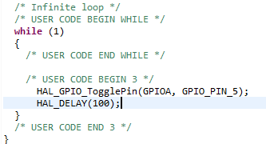

Done step 2.

Onward to step 3: https://wiki.st.com/stm32mcu/wiki/STM32StepByStep:Step3_Introduction_to_the_UART

We configure PA2 for TX (transmit), PA3 for RX (receive). The word length is set to 8 bits meaning the smallest amount of info/the packets are 8 bits. The baud rate is at 115200 bits/s which is the speed of communication. In this configuration we aren't using the parity bit, but it's used to check if the data sent is correct. If we add all our data bits and they're odd then the parity bit is 1, 0 otherwise. So then we transmit this and the receiver can check. It's unlikely that multiple bits change.\
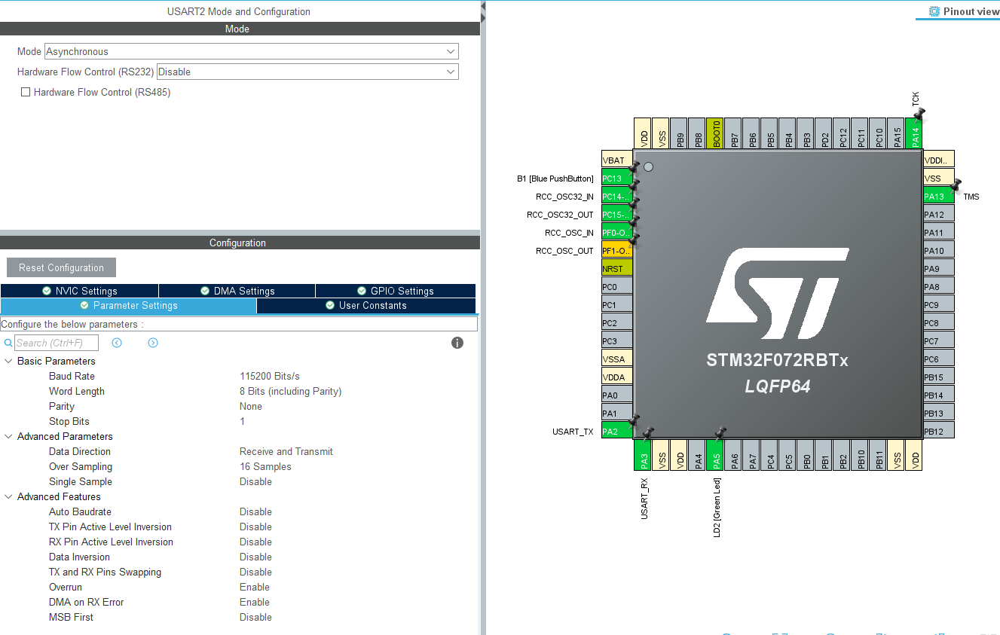
We again write code in the infinite while loop. We have

- uint8_t Test[] = "Hello World !!!\r\n"; //Data to send
- HAL_UART_Transmit(&huart2,Test,sizeof(Test),10);// Sending in normal mode
- HAL_Delay(1000);
  The first line creates an array of unsigned 8 bit integers. As characters are 8 bits this makes sense. At the end we have \r and \n which are control characters. \n will go to a new line and \r will go to the start of the line. View pic for before (with \r) and after (without \r).\
  The second line uses HAL to transmit our message, it takes care of complying with the UART standards such as the timing and sending bits to indicate we are starting communication. &huart2 is our uart handler which we configured at the pin selection stage, we disabled usart1,3,4 (usart async or sync. uart only async). Then a pointer to what we want to print. The size of it which will be 1 more than expected due the null character at the end. And a timeout which i presume to be in ms. 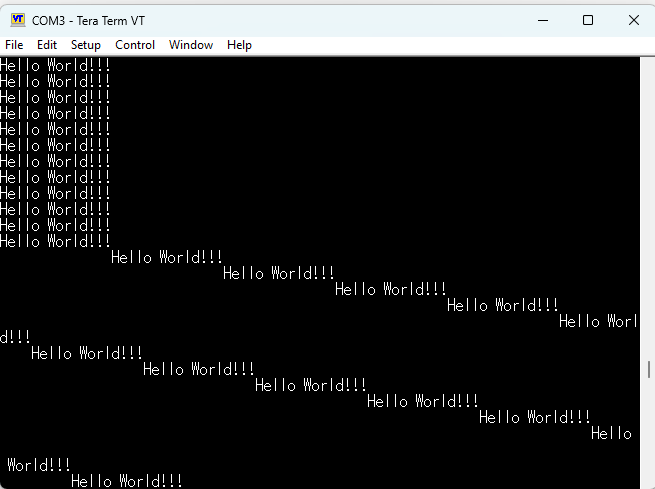

I can't do steps 4 and 5 as I don't have the right board.

Now that I've set up the tools and know the board works I can move on to using my current RTC. It's the ds3231 which uses I2C so to get to know more I will read https://wiki.st.com/stm32mcu/wiki/Getting_started_with_I2C\
Current goal: 

1. get current day from RTC. 
2. make RTC interrupt board when x amount of time goes by
   I2C or I^2C stands for inter-integrated circuit it's a communication protcol. Its name can be broken down into intergrated circuit (IC) which are chips and inter to mean communication between them. I2C is:
- 2 wires: one for serial data (SDA) one for serial clock (SCL)
  - Open drain (normally low) so pulled high using pull up resistors. Lower resistance for higher speeds to change voltage quicker due to tao=RC. Lower resistance = higher power draw/wasted.
- Multi-master: a master is the one that asks the slave to do something. typically a mcu. there can be multiple masters on the same line. so multiple mcus can get data from one slave
- Multi-slave: a slave does the requested action. typically a sensor like the RTC. there can be multiple slaves on the same line. so an mcu can get data from multiple slaves
- Built in collision detection to be able to do ^
- Synchronous: the ICs share a clock line so they are synchronized
- Bidirectional: the data line can be used to read and write so goes both ways
  - Half-duplex: we can only write or read on the data line at a time. not both at the same time
- Serial communication: one bit is sent at a time. as oppose to something like 1 byte at a time.

HAL implements multiple I2C modes: blocking, interrupt and direct memory access (DMA). Blocking is the easiest and slowest, and it should be sufficient. I configured the I2C pins for low speed, blocking mode and with pull up resistors: 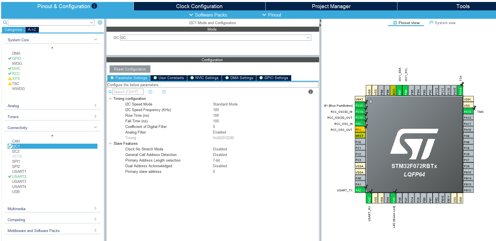 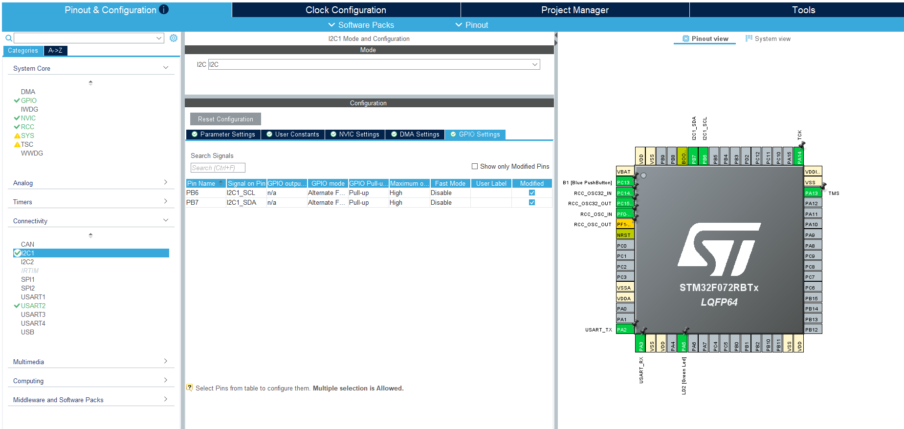

Then I connected them using dupont wires. Vcc and 3.3V, Gnd and Gnd, SCL and PA6, SDA and PA7.

Reading about the RTC there's a charging circuit for the battery which can be dangerous if using a non rechargeable battery like mine. However by board doesn't have the charging components on there. There already exists pull up resistors on the board so I might have to change my nucleo's config or desolder them. 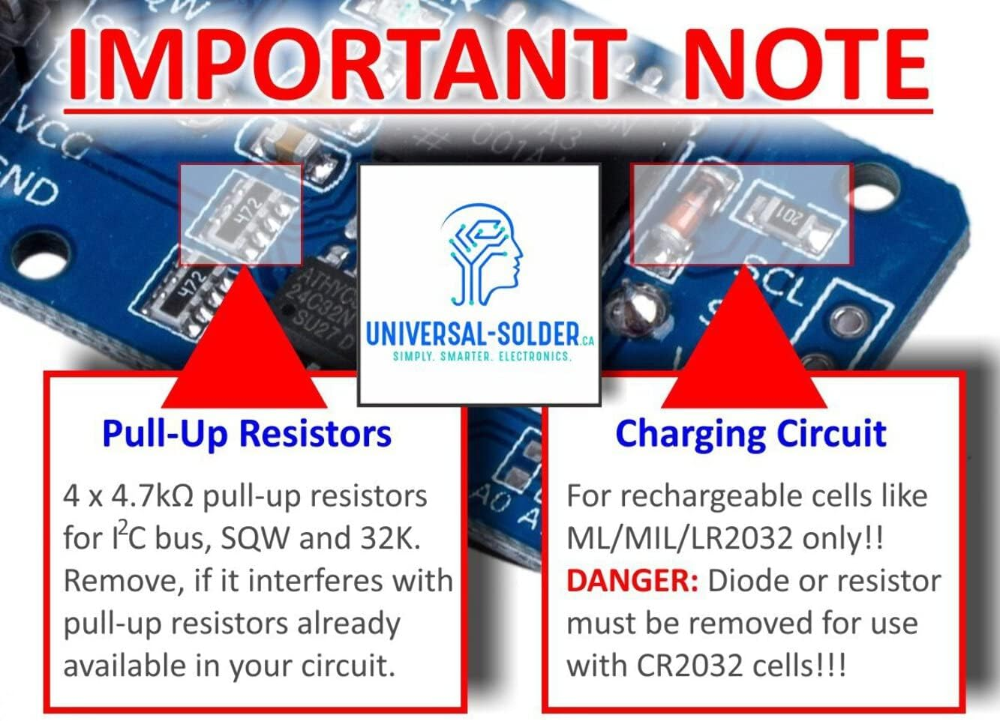 The board also comes with a 32K eeprom and a square wave signal which I doubt I will use.

The tutorial sends random data between two boards but to get proper data from the RTC I need to send something proper. The time is stored in the following registers on the RTC: 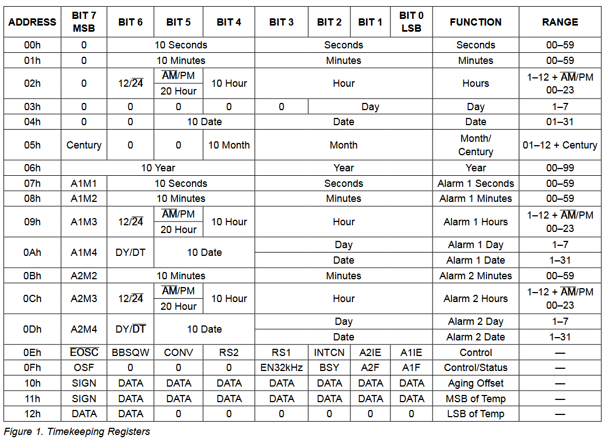
page 15-17 specifies the protocol. most of which i believe will be taken for me through HAL. the main thing I need to pay attention to is that I first need to send 8 bits which consist of the slave address and in the LSB read or write (read active high (normal), write active low (bar on top)).
On page 17 it states the address is 1101000 or 0x68. It also states that in slave transmit mode it will transmit the value in the register pointed to by the register pointer. So we must first set the register pointer. In the slave receiver mode section this is done by sending the register address as the first piece of data.
Here is my code for that
  #define RTC_ADDRESS 0x68
  //set register pointer to 0x04 (date 0-31)
  uint8_t data[] = {0x04};
  HAL_I2C_Master_Transmit(&hi2c1, RTC_ADDRESS, data, 1, 1000);
  HAL_Delay(100);
  //receive the value from the register
  uint8_t buffer[1];
  HAL_I2C_Master_Receive(&hi2c1, RTC_ADDRESS, (uint8_t *)buffer, 1, 1000);

An array is used for one byte as HAL requires a pointer. &hi2c1 is the I2C handle as we are using the 1st I2C port? of the board. We send appropriate address, point to the data to send which has a size of 1 byte. And have a timeout of 1 second. We send 0x04 as thats where the address of the date register in the RTC. Now that the RTC knows what data we want we can read it and store it in a buffer. I used the debugger to get this value.

But it doesn't seem to work as I don't receive anything. I will first check the wiring.

HAL states "The device 7 bits address value in datasheet must be shifted to the left before calling the interface". Which I did not do updating the address from 0x68 to 0b11010000 or 0xD0 worked. The data I received is 32 in decimal: 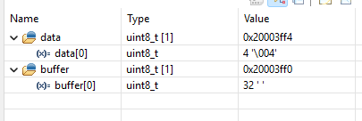 The time is stored in binary coded decimal (BDC) which is a way of storing info in a byte. It splits the byte in two parts, 4 bits each called a nibble. The bits are still interpretted in binary so 2^0 2^1... The lower nibble corresponds to a lower decimal digit and the higher nibble a higher decimal digit. So 32 = 0b0010 0000. 0b0010 = 2, 0b0000 = 0, combine them to get 20, which is correct.

Goal 1. done.

Now for goal 2. The idea is to use the alarm on the RTC to send an interrupt signal (explain interrupt) to the MCU at a certain time interval. These are the possible alarm configurations: 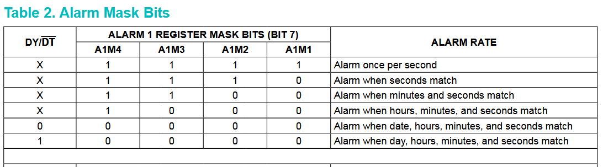
I can use "Alarm when hours, minutes, and seconds match" to set a daily alarm as the same hour/minute/second only happens once a day. The alarm is set using 7-10 register. The MSBs in these registers are mask bits and specify if we want to match with this time. As shown in the table, if we set mask 4,3,2 so mask for day,hour,minute to 1 we are ignoring them so we only match the second. (page 12). To trigger an interrupt on pin !INT (active low interrupt) when the alarm goes off we must set the A1IE (alarm 1 interrupt enable) bit and INTCN to 1.
I begin by writing the alarm bits and reading them back to ensure it happened correctly: 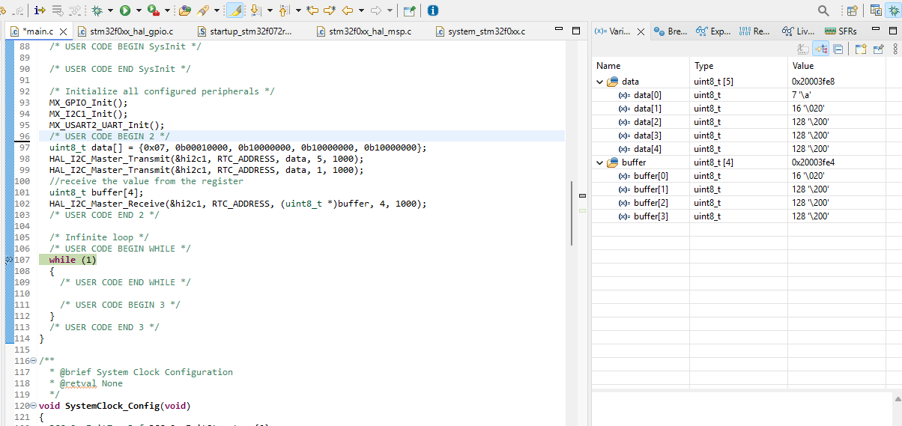. I make the register pointer 7 then I write 4 bytes as the register pointer increments after every write. This unmasks the seconds, makes the 10's digit a 1 and the rest 0, the rest are masked. So this should be an alarm every minute. I write 0x07 again to reset the register pointer so I can read from the right place. Then to make A1IE and INTCN 1. I first just printed all the registers so I could have an overview of everything and see what was already in place to make sure I don't mess anything up. Apparently it was outputing a 32K signal so i disabled that. It should now be working and I could use a GPIO or LED to check that but the fastest thing for me to use and which isn't prone to bugs is to use an oscilloscope. Way overkill but it works. From this I realized the interrupt only happens when A1IE is 0 so I had to reset it every time.

First interrupt at about 34 seconds into the minute
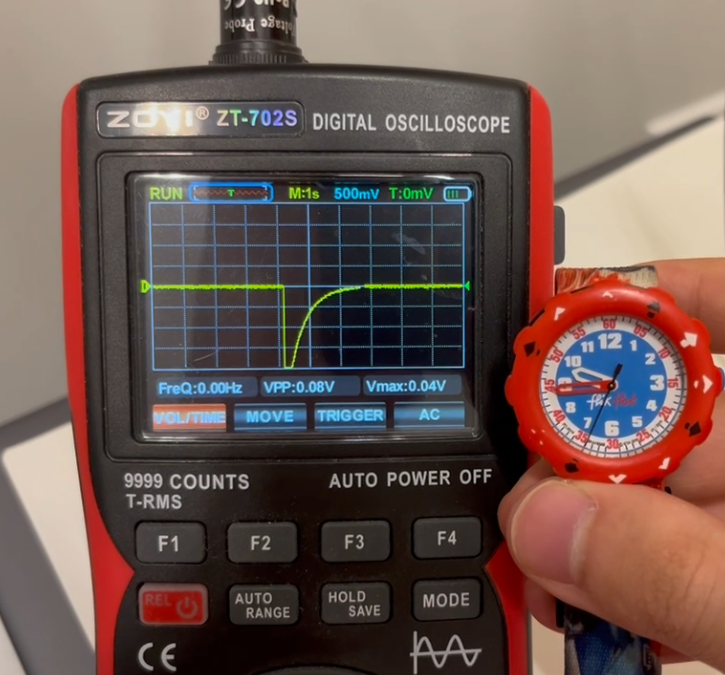
Second interrupt one minute later
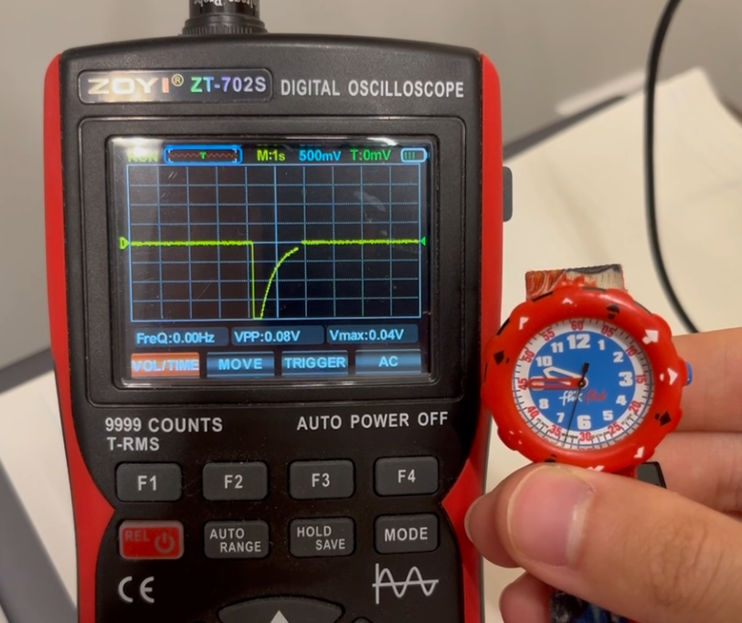