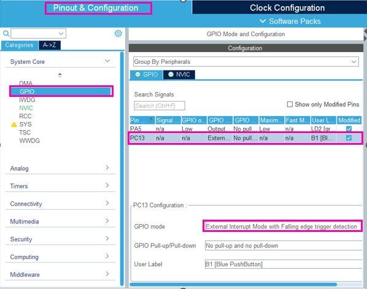
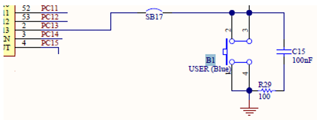
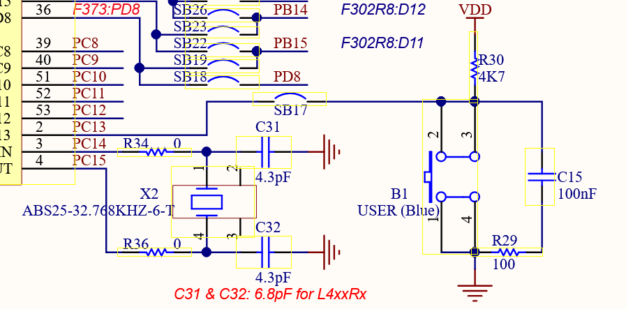
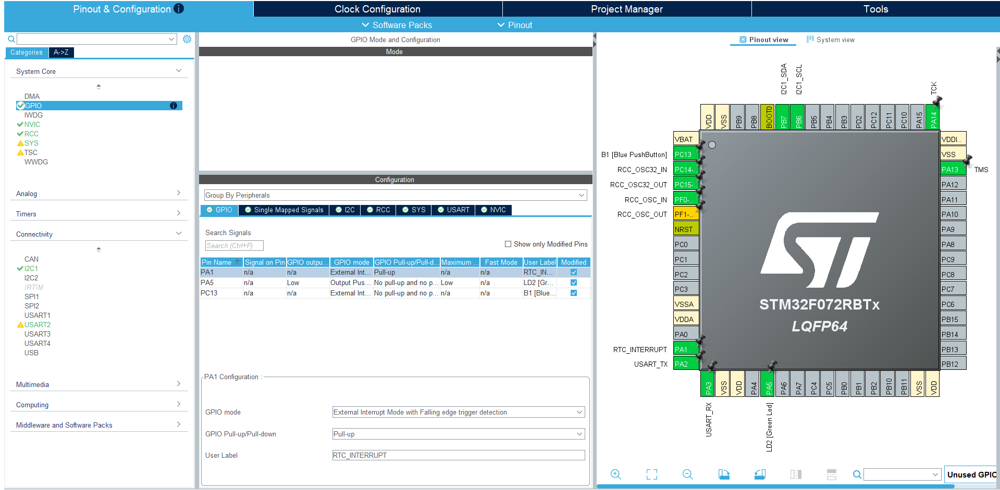
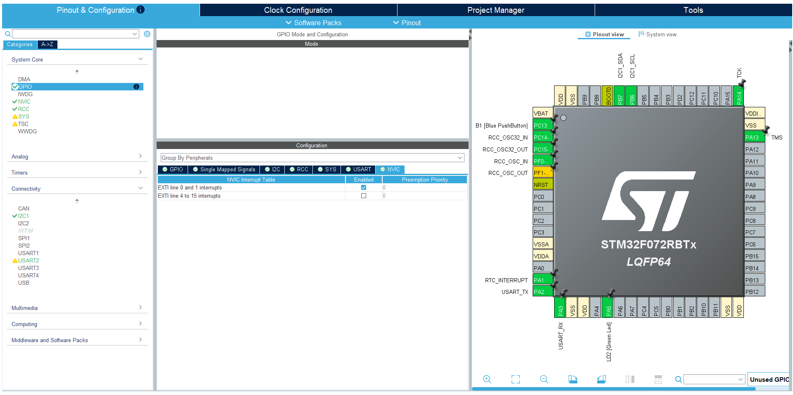
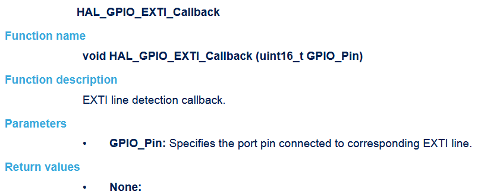
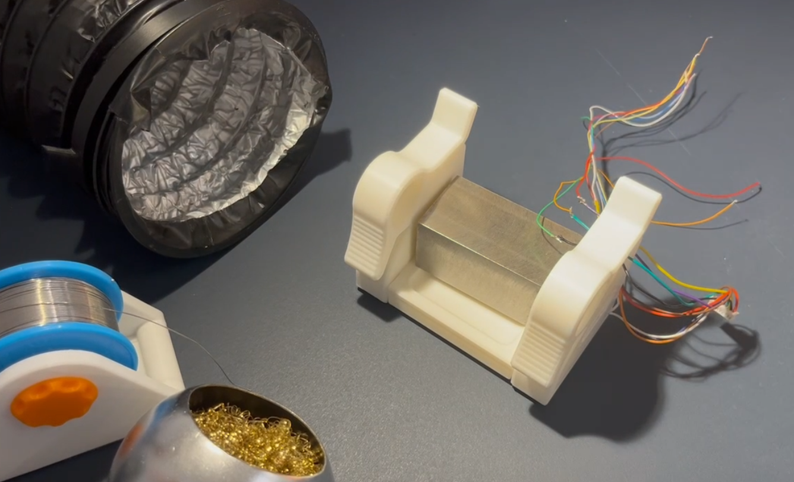
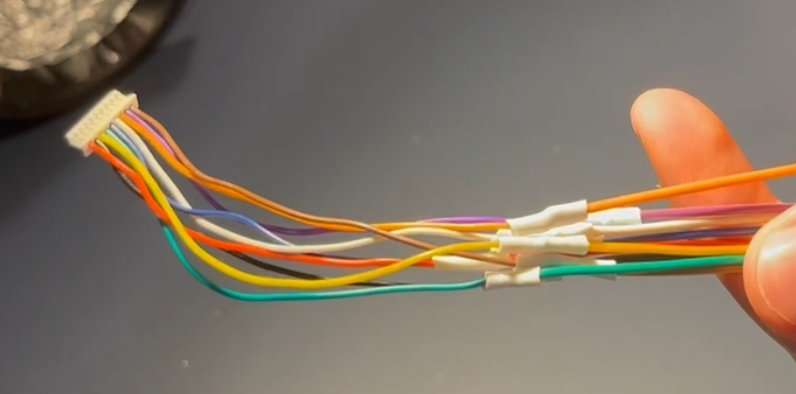

With the interrupt coming in now I need to make an interrupt service routine to handle it. I will use this tutorial https://wiki.st.com/stm32mcu/wiki/Getting_started_with_EXTI\

I was really confused by their example as they use a button for an interrupt which pulls low when pushed but they dont use an internal pull resistor. And the schematic it shows it being floating, however it seems a little cut off. Finding the full schematic they left out the pull up resistor :/.

  

On page 9: "This open-drain pin requires an external pullup resistor connected to a supply at 5.5V or less." so I will configure my pin to pull up (when making the pcb i can consider using an external one). Read about NVIC and EXTI 72RB datasheet pg 17. My config:  
I need to make a generic callback functions for all pins which then inside checks which pin was the interrupt. But there is only one input, the pin number and the pins have ports like A, B, C. So i was confused as to what number this pin is, but looking at the docs it specifies it wants the number regardless of the port. 

Here is my code:
void HAL_GPIO_EXTI_Callback(uint16_t GPIO_Pin){
if(GPIO_Pin == GPIO_PIN_1){
HAL_GPIO_TogglePin(GPIOA, GPIO_PIN_5);
//reset interrupt on RTC
uint8_t data[] = {0x0F, 0b00000000};
HAL_I2C_Master_Transmit(&hi2c1, RTC_ADDRESS, data, 2, 1000);
}else{
__NOP();
}
}
If the interrupt was caused by my configured pin then I toggle the led at pin 5. And i reset the interrupt bit in the RTC so it throws another interrupt next time. It works. So goal 2 is done.

Now I can I work on the screen. I will use: https://wiki.st.com/stm32mcu/wiki/Getting_started_with_SPIIt uses SPI which stands for serial pheripheral interface. SPI is:

- One master many slaves
  - Each slave can only have one master
  - A master can have multiple slaves and interact which each by having a dedicated chip/slave select pin for each (so they don't need a dedicated address each like I2C)
- Synchronous (has a shared clock signal)
- (Can be) Full duplex
  - Data can be read and written at the same time by using both the MOSI and MISO lines at the same time
    Pins:
- MISO: master in slave out
- MOSI: master out slave in
- SCK: serial clock
- !SS/CS: chip select
  SPI is not standardized so there are some things to watch out for like clock polarity and when to sample. To figure out how I had to configure the project and to see how I was going to communicate with the screen I pulled up the documentation. The english isn't always great and some of the images are quite blurry but I can work with it. This screen has color unlike the final one and it has a driver board which is mostly passive components, a Bidirectional Voltage-Level Translator which lets communication happen through wires with different voltages (I don't believe I need this on my final board as I will only use the screen driving voltage of 3.3V) and a eeprom. They provide example code for a stm32 board however they warn some boards might not have enough storage so some settings might need to be adjusted. However first I need to solder some wires as the driver comes with jst connector but my corresponding female wire only has bare wires at the end and doubled up wires through soldering. Didn't have brown, orange or purple so I had to take it from a rainbow connector.

Just like I2C HAL has multiple implementations of SPI: blocking, interrupt (non blocking), dma (non blocking). I will use the simplest for now: blocking.

Wire for the sceen has JST connector on one end and the other is just loose wires. To better connect them to the board I stripped them and soldered wires with female dupont ends.
Before:

After (with dupont female on the other end):
