after some research the optimal way to debounce a button using hardware is with an rc circuit and a schmitt trigger. An initial solution can be to use an RC circuit to smooth the output of the button. 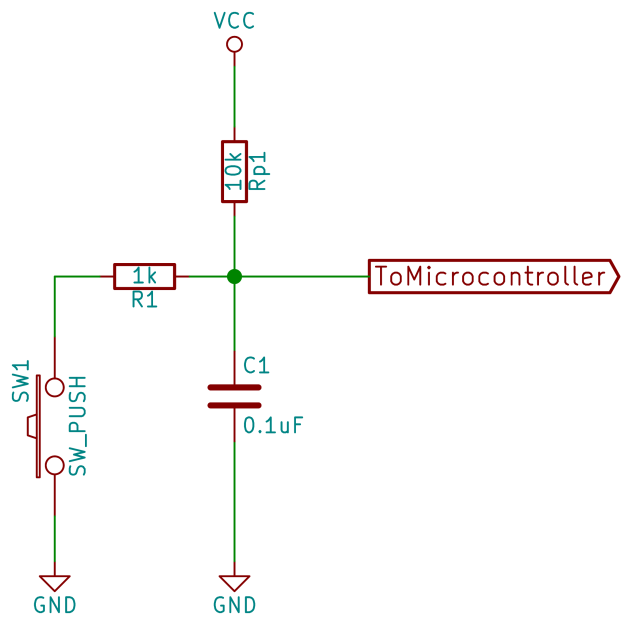
When the button is open the cap charges slowly through the 10k pull up resistor. Then when the button is pressed it discharges quickly through the 1k resistor pulling the gpio low, fast compared to charging slow compared to the debounce: 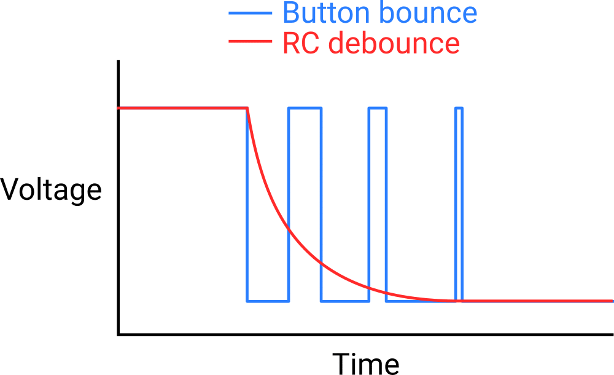
This creates an issue, when in the digital world we only work with low and high, which we swich between very quickly like those big spikes in the bouncing. Now we are introducing intermediatery voltages, when you're in between the high voltage and low voltage something like 2v then the reading is undefined. It's unstable which is why we typically spend the least amount of time in that danger zone as possible. The solution is to use a schmitt trigger. It will drive the output high when the voltage is above a threshold and will drive it low when its lower than a threshold. That way the only outputs are high and low. Another important part is that the high and low threshold voltages are not the same. If high threshold is 2.5v and low is 1v then we can be bouncing around in between them without changing our output. This also creates hysteresis, meaning our new output depends on our current one (like a mealy machine). So if we are outputting high and some noise puts us under 2.5v then the output stays high. Compare this to one threshold value of 2v. If we are at 2.2v we output high but with some noise we can bounce between 1.8 and 2.2v which will cause our output to bounce. 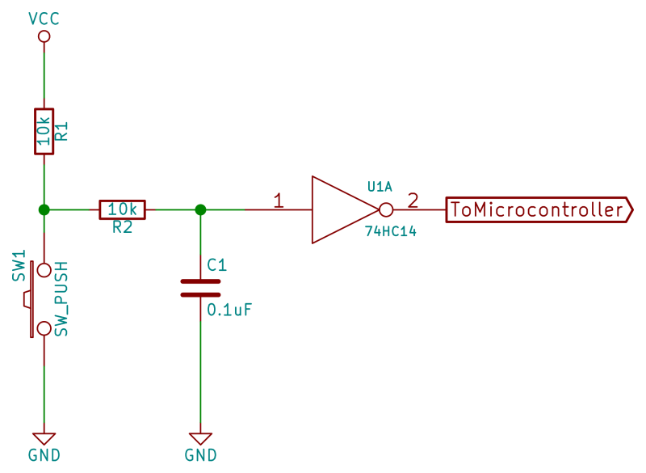 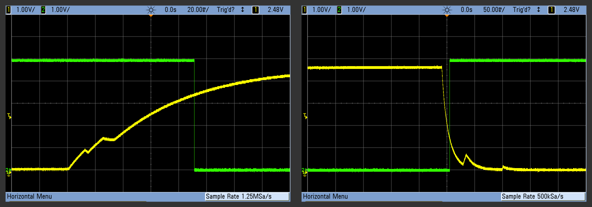
If we only used the schmitt trigger without the RC circuit then the button bounces would bounce between the thresholds and the output would bounce the same way. To the RC circuit smooths our output and the schmitt trigger makes the output binary.
The schmitt trigger works by using positive feedback on a comparator to saturate the output to the rails.
I've found that I can use a 555 as a schmitt trigger as I don't have one. The 555 is mostly a schmitt trigger with a low threshold of 1/3vcc and 2/3vcc but automatically discharges the rc circuit to keep pulsing. We/the button is the one that will discharge the circuit so we don't need that part. The rest is hooked up the same as an astable configuration of the 555.

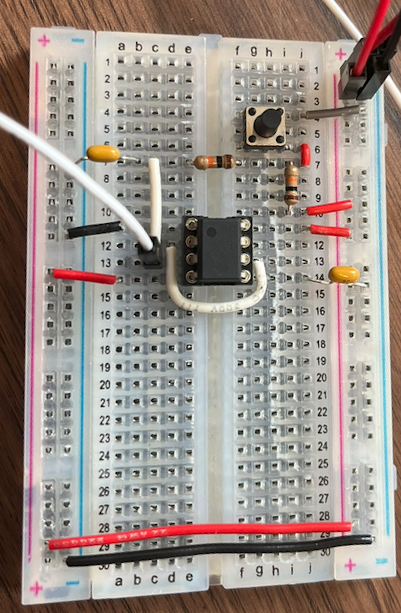

Next step is making the mcu sleep and wake. I will use: https://wiki.st.com/stm32mcu/wiki/Getting_started_with_PWR
I realized to know if its actually sleeping I would need to measure the current. The easiest way would be to power it through a battery as I intend in the end. But I don't currently have a coin cell holder, I considered soldering wires to the RTC one but I realized I have AAA battery connectors from a kit so I just printed a model to hold 2 so it would make 3v. I measured each battery and also when connected i get a solid 3.35v. I used alligator clip leads for the multimeter so i could more easily stay clipped to the battery. I was able to stick a wire into the spade connector of the battery wires to connect to the breadboard. It seems I just connect it straight to Vdd/3.3v. I later found a 3D model that just used dupont wires as the terminals for the coin cell, printed it and works great.

The f401 should draw 6-17 mA at room temp depending on how many pheripherals are enabled, in sleep mode. 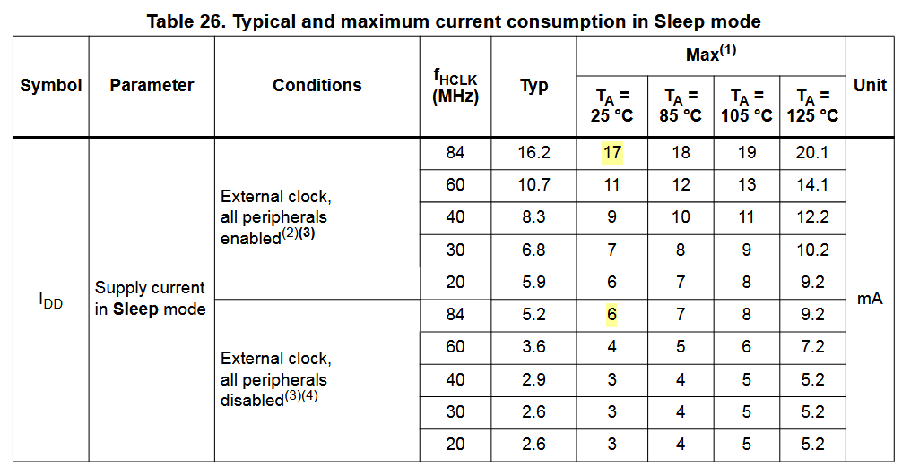 I connected it and it was drawing 5A, I though everything was fried but then I realized I was in A mode instead of mA. It was actually drawing 40-45mA, this is probably due to the pheripherals. Instead of disconnecting everything im just going to use another board for now.

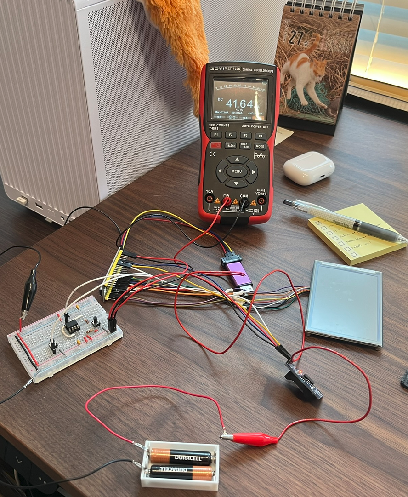

I made a new project where I only have the debugger, clock, led pin and button configured. I also checked make unused pins analog to optimize power consumption. 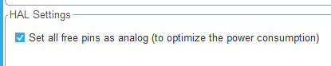 I will make the led toggle just to see what happens when we go into sleep/other power modes. The button has an interrupt which will be used to wake the board. I was confused when it read 26mA but after taking off the st link it went down to 5.8mA. When I click the button it jumps to something like 50mA then goes right back due to the routine. 

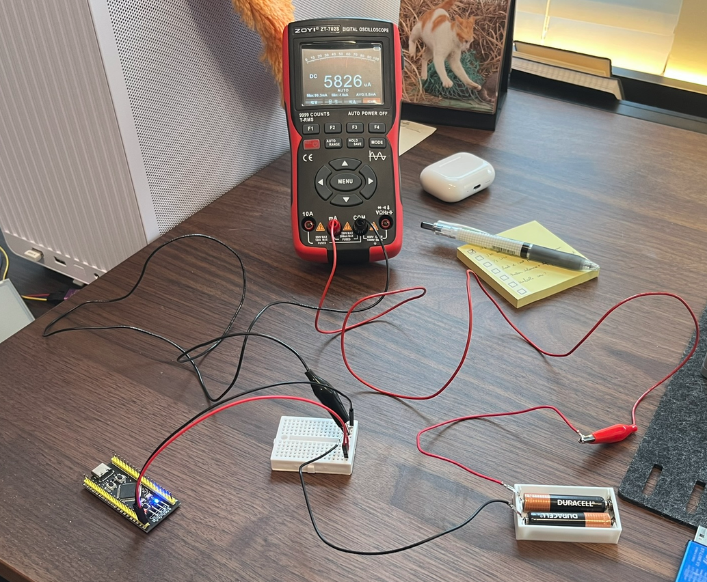

Here is the code:

```
while (1)
{
    HAL_SuspendTick();
    HAL_PWR_EnterSLEEPMode(PWR_MAINREGULATOR_ON, PWR_SLEEPENTRY_WFI);
    HAL_ResumeTick();
    HAL_GPIO_TogglePin(LED_GPIO_Port, LED_Pin);
    HAL_Delay(400);
}
```

Using the "PWR_SLEEPENTRY_WFI" mode the board wakes up on any interrupt. Each ms there is an interrupt to increment the tick counter, so we must disable that before sleeping so it doesnt wake us up the next ms. Then it just toggles. I can observe that the led stays in the same state on sleep and does not blink. When it wakes it seems to resume from where it was.

Next I'm going to try shutdown mode, the most aggresive power down mode. I want to see if I can use the button interrupt to wake up the mcu and know which button it is. With that I can use it to wake up the mcu, know who cleaned and update the screen accordingly then go back to sleep. I would also be able to know if the rtc woke it up so i can refresh the screen. The current board doesn't support this but can do standby which is very similar. In this mode the mcu is basically fully powered off so waking it up is the same is we pressed reset or power cycled the board. The only benefit is we know what pin woke it up. On this board there is only one wakeup pin, which is connected to the on board button. The mcu wakes up on a rising edge.

```
  __HAL_PWR_CLEAR_FLAG(PWR_FLAG_WU);

  while (1)
  {
      HAL_PWR_EnterSTANDBYMode();
      HAL_GPIO_TogglePin(LED_GPIO_Port, LED_Pin);
      HAL_Delay(400);
  }
```

Reset power flag so we can go back to standby again. Go into standby, toggle led.

It seems I cannot program the board as it keeps sleeping :). But after many tries with holding the reset button it worked. I later tried to use the hardware reset option and that worked. It draws 306 microAmps instead of the rated 2.5. I do see a small led on though and this isnt the bare chip so its expected. I will desoder the power led and check again. It was indeed most of the current draw now it averages to 10-11 microA. 

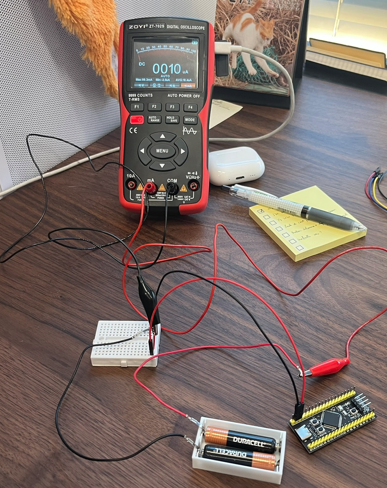

The problem is it doesnt wake up on button press. I realized I could configure the pin as sys_wkup so i did and now i cant pull it high. The button only pulls low so i cant have a rising edge with that. Instead i touched the pin with vcc with a pull up resistor. This still didnt work. I learned that i have to use HAL_PWR_EnableWakeUpPin(PWR_WAKEUP_PIN1); and that worked.

next: check how to keep values on sleep

I also realized that because the mcu needs like 300 uS to wake up it suffices as debounce for the button, lol.

todo: figure out what the power flags means

note: for the pcb add lots of test points and jumpers. ex: jumper connects battery to board so i can disconnect and measure power. also one for led so i can measure power without it.

sources: https://hackaday.com/2015/12/09/embed-with-elliot-debounce-your-noisy-buttons-part-i/
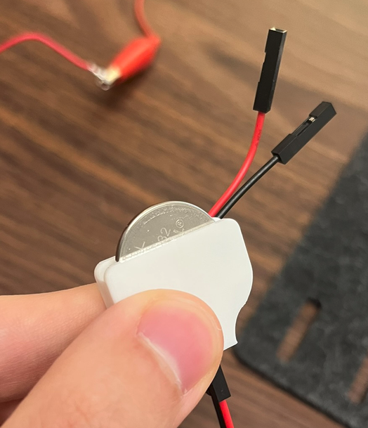
