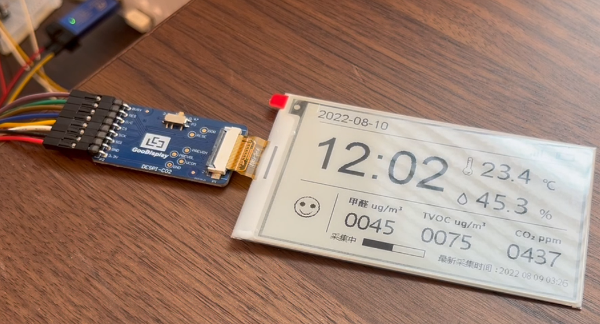

- Changed the mosfet to the i bought
	- Still same
- Realized busy and cs were swapped
	- Fixed it, still same
- Changed functionality of their delay_xms which used a for loop to instead use HAL_Delay
- Realized in their config they have a pull up for busy
	- Changed that, still same
- Realized that the code is so old they probably don't use the HAL SPI functions so it doesn't make sense to configure the pins as SPI. Looking at the code they manually pull and down the clock, lol. Changing the pins to output very high speed gpio worked!
- 
-