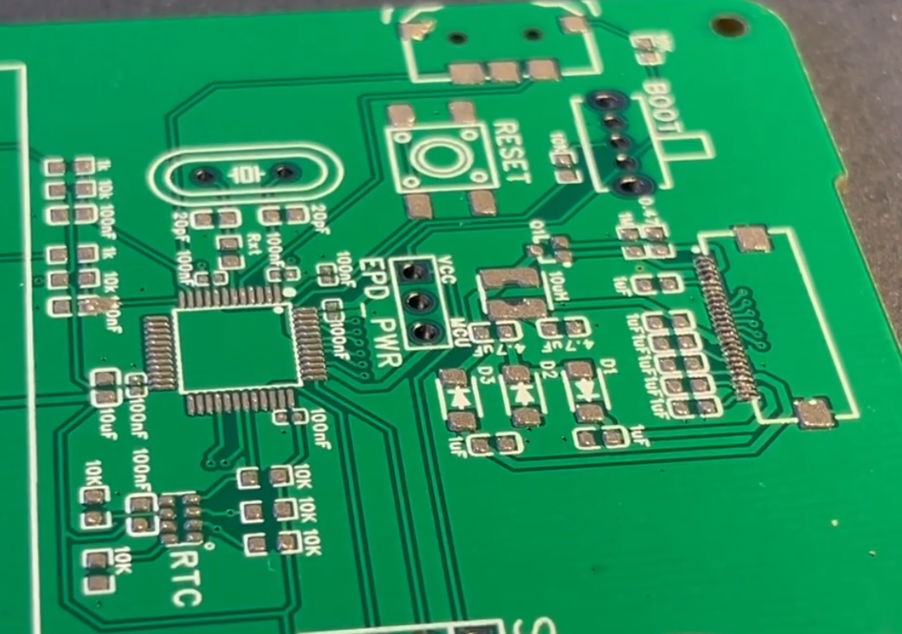
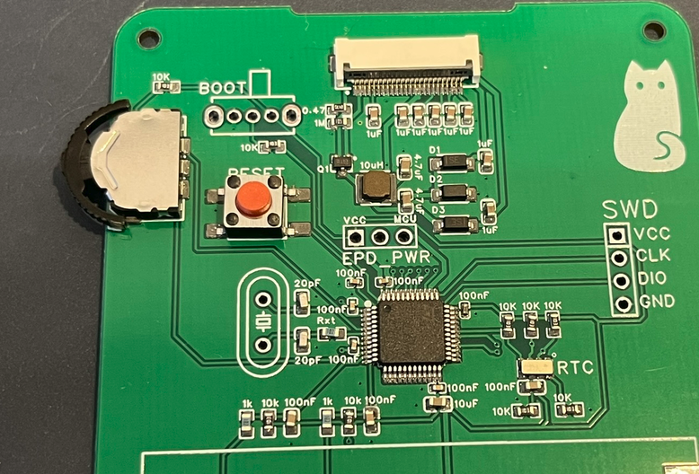

- Opened PCB
- Put paste using stencil
	- 
- Put components on
	- Made sure to put diodes in right way same with MCU
	- MCU came vacuum sealed with humidity meter
	- Checked if some components will melt (FPC connector, button, switch)
		- FPC shows good for reflow, others dont mention
		- FPC says 85C for ambient but good for reflow the others either dont mention or say similar ambient. I will try
	- 
- Used reflow oven