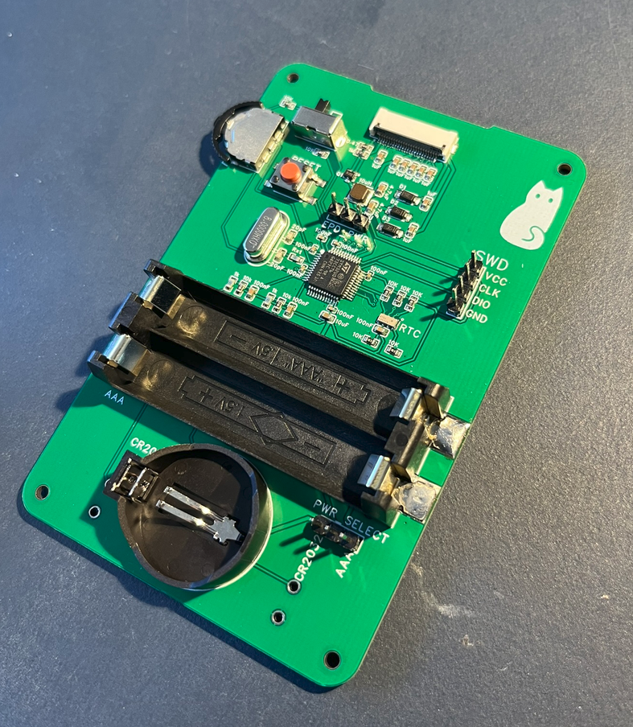
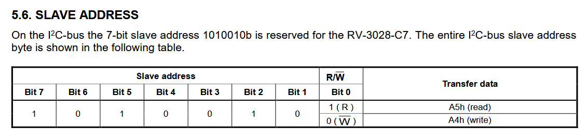
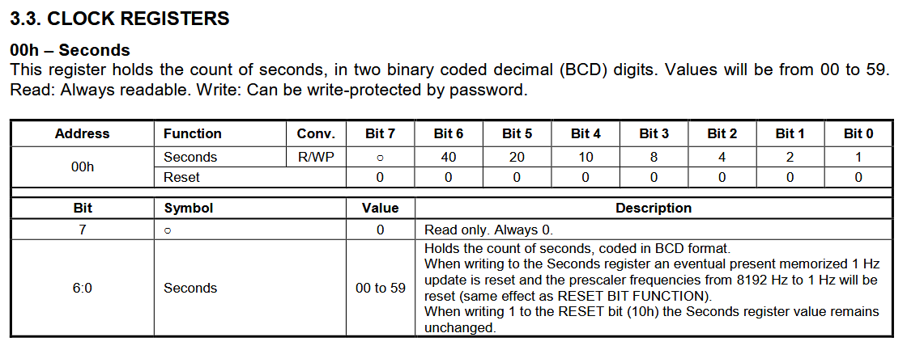
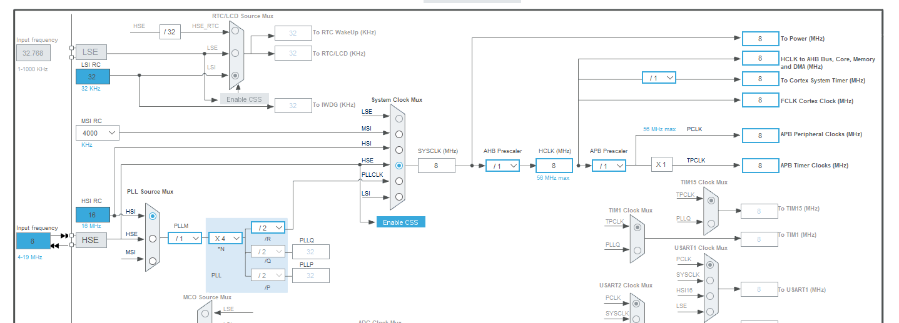
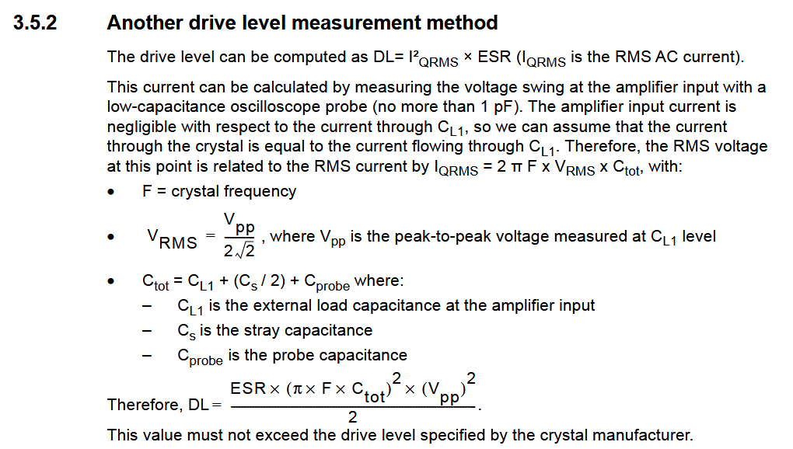
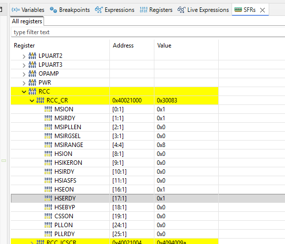

- Soldered header pins for SWD
	- {:height 600, :width 546}
- Flashed dummy code, flashes!
- Will first test communication with RTC then external clock
	- Found RTC address from datasheet. As learned before making LSB 0
	- {:height 93, :width 587}
	- The operation is the same as the other, there is a register pointer that I can change or continue reading from, which will increment by one at each read or write
	- I will just read the seconds every second
	- ```
	    #define RTC_ADDRESS 0b10100100
	    uint8_t data[5];
	    for(int i = 0; i<5; i++){
	    	  HAL_I2C_Mem_Read(&hi2c1, RTC_ADDRESS, 0x00, I2C_MEMADD_SIZE_8BIT, data+i, 1, HAL_MAX_DELAY);
	    	  HAL_Delay(1000);
	    }
	  ```
	- I read 5 seconds in a row. The output:
	- ```ascii
	  101000
	  101001
	  110000
	  110001
	  110010
	  ```
	- {:height 251, :width 657}
	- Given their format this good. It goes 28, 29, 30, 31, 32
	- Great. RTC works and I can communicate with it. I need to set up the alarm interrupt
- I will now try to use the external clock with the same code
	- I set the system clock to use the external high speed clock (HSE) and told it its at 8Mhz. I already enabled crystal/ceramic oscillator option in the RCC (reset and clock control) section so it would allow me to make this selection
	- 
	- I will just check the value of the external resistor again as I currently have it set to 1K and that might be too high
	- {:height 327, :width 582}
		- i get ((1/2)\*(60)*(pi\*8000000\*(21.5\*10^-12))^2\*(3.3)^2)\*10^6 = 95.4 uW
		- by using 8mhz. 20 pF CL1, 3pF Cs, no probe, 60 ohm ESR (from datasheet for 7-10mHz) and 3.3V drive voltage
		- this is about the 100uW ideal drive level and well under the 500uW max. Im not sure how I did my previous calculation. Its also possible I used a different datasheet because this pack of crystals is unlabelled. But looking at more datasheets they have very similar values
		- I will replace the 1K with a 0 ohm before flashing
	- It's now that I wish I had put on leds or broken out uart as i'm not sure how to test if the hse is working
		- online they recommend to check the HSERDY bit
		- from the U0 reference manual "The HSERDY flag in the Clock control register (RCC_CR) indicates if the HSE oscillator is stable or not". With 1 indicating ready and 0 not
		- 
		- works!!!
- Next big thing is the eink