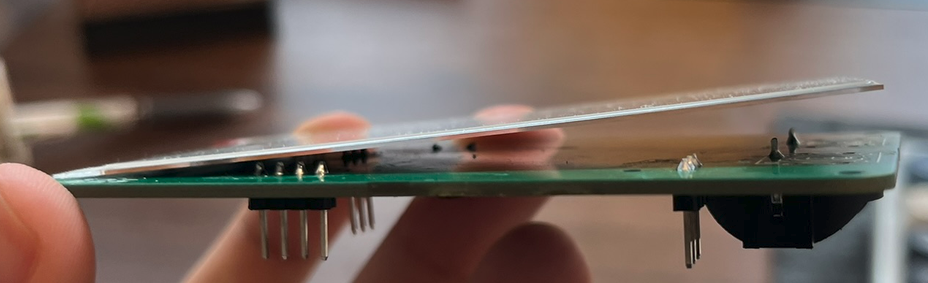
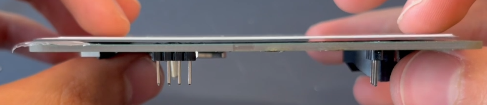

- All the hardware works, I now just need to program it and make a case. A case which accommodates the keys
- Took out the AAA holder as the cr2032 works, had lots of difficulty
- Reworked the eink power headers to sit flush
	- Before:
	- 
	- After (used a piece of paper to make it higher on the left so the gap stays constant)
	- 
- Cut all the through hole parts on the other side and filed them flat so the eink could like flat
- Because it was hitting the top side before the bottom it was still tiled. I added a piece of paper folded three times and tape to that side so it would sit higher and then the other side sat flat (have videos)
- Exported board outline and multilayer as DXF. Put them in onshape and made offset so screw holes are in the same place but board outline has 0.4mm wiggle room. 0.3mm thick just like the paper, used as a spacer. Will 3D print.
	- After testing it, it doesn't help. I think I might've not had the connector in all the way. The paper doesn't do the trick either.
	- It doesn't matter much it barely sticks up so I can push it down with the case. If i were to make iteration I would bring the connector up
	- It also showed me I dont have room for nuts next to the screen. In the case I will model holes so I can screw into the case and it will act as a nut
- Spent a good chunk of time modelling the case, now I print
- Need to fix a few things, many frustrations with onshape, learned a few things
	- Definitely did not forget to model a slot for the slider