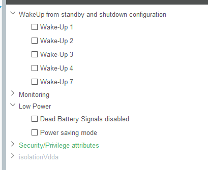

- It seems there are too many things going on so it makes it hard to pinpoint the problem. I will make a new project and just interact with the RTC to get the alarm working consistently and on the first boot.
	- As I need to test on first boot I can't use SWD so I will use an oscilloscope to see if interrupts are being made.
	- I just configured RTC I2C, RTC GPIO input to read interrupt if needed and SWD
	- ```
	  //rv3028.c
	  HAL_StatusTypeDef RTC_init(I2C_HandleTypeDef *hi2c){
	  
	  
	  	//disable clkout to use less power, since we don't need it (as specified in datasheet)
	  	//uint8_t fd = 0b00000111; //disable using fd = 111
	  	//HAL_TRY(RTC_set_register_value(hi2c, 0x35, &fd, 1));
	  
	  	//setup hour alarm to trigger at midnight and one minute
	  	uint8_t midnight = 0x0;
	  	HAL_TRY(RTC_set_register_value(hi2c, 0x08, &midnight, 1));
	  	uint8_t minutes = 0x1;
	  	HAL_TRY(RTC_set_register_value(hi2c, 0x07, &minutes, 1));
	  
	  	//set AIE bit in control 2 register high to enable alarm interrupts
	  	uint8_t enable_alarm = 0b00001000;
	  	HAL_TRY(RTC_set_register_value(hi2c, 0x10, &enable_alarm, 1));
	  
	  	return HAL_OK; //no previous HAL_TRY returned so all good
	  }
	  //main.c
	    HAL_StatusTypeDef status;
	  
	    do{ status = RTC_init(&hi2c1); } while(status != HAL_OK);
	  
	    //set time to 20 seconds before interrupt
	    uint8_t time[] = {0b01000000,0x00,0x00,0x00,0b00000001,0b00000001,0x00};
	    do{ status = RTC_set_register_value(&hi2c1, 0x00, time, 7); } while(status != HAL_OK);
	  
	    HAL_Delay(25000);
	  
	    RTC_handle_interrupt(&hi2c1);
	  ```
	- I tried this, and it works perfectly except on the first boot.
	- I'm getting an AK from the I2C communication so I'm sure the RTC is getting my config, the only real explanation is that the eeprom mirror is overriding everything or at least messing something up like giving me a false AK
		- I have two things I would like to try:
			- wait until EEbusy bit is low before writing config
				- I added this at the start of main to check EEBusy every 10 ms
				- ```
				    uint8_t buffer[1];
				    do{
				  	  RTC_read_register_value(&hi2c1, 0x0E, buffer, 1);
				  	  HAL_Delay(10);
				    } while(buffer[0] & 0b10000000); 
				  ```
				- Worked great, just had an interrupt right away so I added a interrupt handle line after the above code block
					- I removed the rest of the code except the above and there was no interrupt, so there was something in my code causing the initial unwanted interrupt
					- I suspected turning on the alarm interrupt (by setting AIE high) and commenting that out works. But obviously I still want the alarm. I will try to set AIE to 0 before setting anything else like the time. And I will try to set AF to 0 before setting AIE to 1. I will implement these separately. The thought is maybe AIE started as 1 so could've for some reason let an interrupt through or AF was 1 so when AIE became 1 it let out the interrupt
						- I tried the AF solution first and it worked, meaning that the AIE line isn't the culprit it's just that I don't see that AF is high before this as only when AIE is high will it let the interrupt through. So some other line made AF high or it's default.
					- I will try removing all the code again except for AIE high so I can see if AF is high by default.
						- AF isn't high by default
					- I realized I set the hour alarm first, which enables the hour alarm for midnight. And it's already midnight so it flips AF right away. And the interrupt is just passed through when AIE goes high. By setting the minutes alarm first the alarm isn't instantly triggered and everything works.
			- experimenting with putting the time close to the next day
				- By default the EEPROM mirror happens every new day, I haven't been able to experiment with it since it only happens on first boot and SWD doesn't work on first boot. But by setting it close to the next day I can use SWD even after a reset and with the reset I'm sure my config is there then I can read back the RAM to see if my settings are still there. This should definitively tell me if the EEPROM mirror is messing up the config unless the vey first mirror on boot is special
-
- Found this while configuring new project, probably handy for the future
	- 
	- Under Power and Thermal > PWR in CubeMX
-
- For next time:
	- Experiment with eeprom close to next day