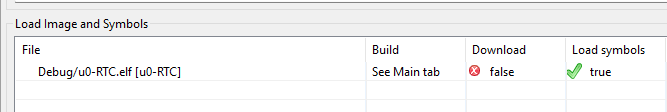

- Experimenting with EEPROM near the end of the day
	- Keeping initial EEBusy waiting period, keeping alarm and AIE setting
	- Setting time to 23:59:40, setting fd = 111
	- Will read right after setting the settings and 25 seconds later
		- Initially: should see everything the same as when I set them
		- After 25 seconds: eeprom refresh should happen and only fd should be reset
	- Indeed only fd is reset
	- Now I want to try writing settings while EEBusy to replicate what happens on first boot but now I can use SWD. I will write the time, wait 18 seconds, then continuously read EEBusy until is then right away right settings. Actually reading further, the daily refresh is different than the POR one. Rather than trying to infer what's happening through it, it's clear to me that I simply need to debug POR, and since I can't use SWD for that I need to figure out some other way.
		- I was thinking of using the two exposed pins for SWD and set them as GPIO output then just dump the RTC config there and read it back with the logic analyzer. But this felt too complex, there must be a way to use SWD for POR. Reading more into it I can literally just disable downloading the program when debugging which is exactly what I want.
		- Under Debug Config>Startup
			- 
		- I will then just run the same program I had yesterday (+ setting fd), without waiting for EEBusy and use the oscilloscope to confirm that we are not getting an interrupt. And use SWD to read the config.
			- Since I was using the GND pin breakout on SWD for the oscilloscope instead I will connect it to the second GND on the STLINK since I checked for continuity and the second GND is attached to the rest.
			- Still reruns the code, but doesn't flash. Trying disabling "set breakpoint at main", disable "verify flash download", enable log file, reset behaviour set to "none"
			- Even after trying many different configurations I could not get it to actually stop at a breakpoint or read any variable. Whenever I paused it was always stuck at one line and would refuse to move on. It seems to just be broken, or maybe meant for another use case. I'm going to go back to omitting SWD. I will just output high if what I read back was as intended or low otherwise on a pin I configured as GPIO output.
				- I will begin by just checking is AIE is set, since we don't get an interrupt it's either AF or AIE.
					- AIE does appear to be low.
					- I will set AIE high before checking to see if my code works and outputs properly and to see if an interrupt will appear.
					- Pin does go high, but no interrupt, meaning AF is low, meaning no alarm happened. It is not abundantly clear to me that writing during the EEBusy period corrupts something. I don't think it's worth pursuing to figure out exactly how or why. It seems that the data sheet just seems to be unclear to mention that not only should EEPROM not be manipulated in that time, but also RAM. I will stick with polling until EEBusy is low at the beginning of the code.
					- Just as a last confirmation as im curious if the initial mirror/refresh overrides what I have or my config never reaches RAM. I removed everything, just set AIE = 1 then read it back right away and outputted that to the GPIO. It stayed low. Meaning that even with a AK from I2C during the refresh period nothing written is actually written to ram. As far as I can tell this seems undocumented.
						- ```
						    HAL_StatusTypeDef status;
						    uint8_t enable_alarm = 0b00001000;
						    do{ status = RTC_set_register_value(&hi2c1, 0x10, &enable_alarm, 1); HAL_Delay(10); } while(status != HAL_OK);
						    uint8_t buffer[1];
						    do{ status = RTC_read_register_value(&hi2c1, 0x10, buffer, 1); HAL_Delay(10);} while(status != HAL_OK);
						  
						    if(buffer[0] & enable_alarm){
						  	  HAL_GPIO_WritePin(Com_GPIO_Port, Com_Pin, GPIO_PIN_SET);
						    }else{
						  	  HAL_GPIO_WritePin(Com_GPIO_Port, Com_Pin, GPIO_PIN_RESET);
						    }
						  ```