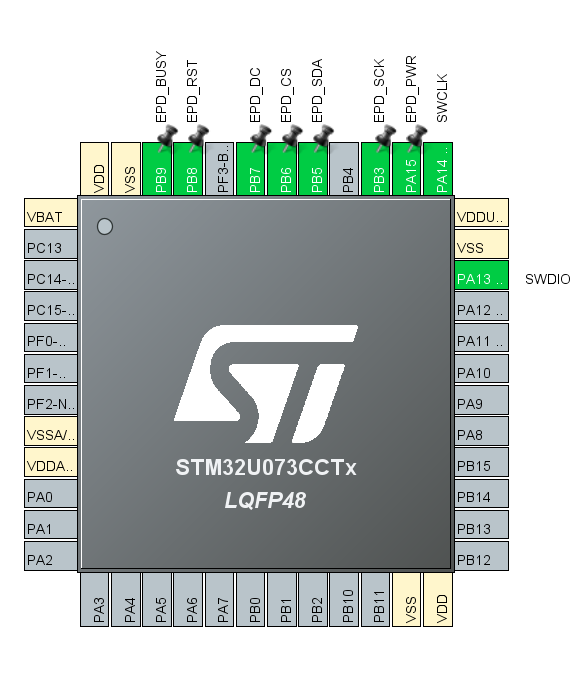
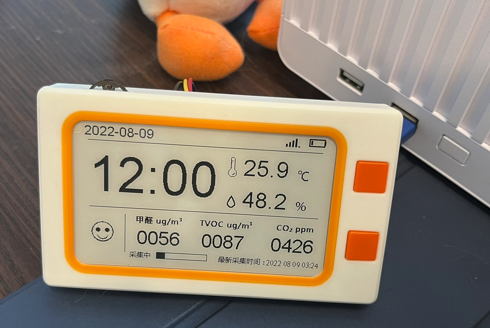
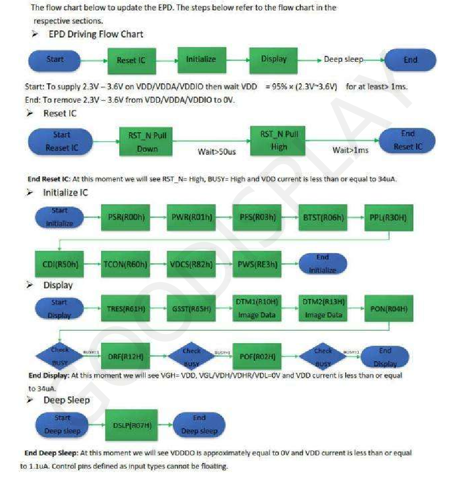
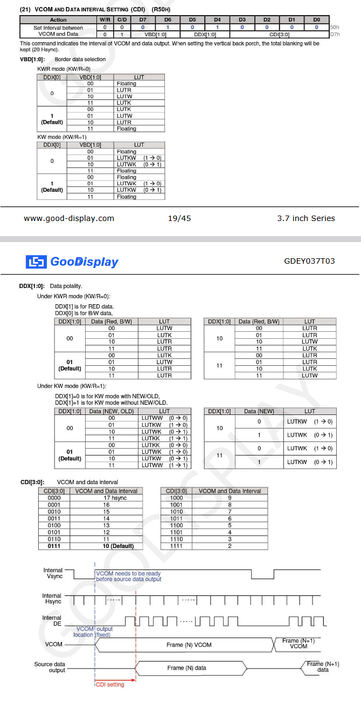

- Going to make a library/driver to interact with the epd
	- Making a new project to keep it clean
		- {:height 387, :width 324}
		- Just screen + debugging. Keeping same config as I had in the main project where it's just GPIO instead of specifying SPI. Just to make sure it all works then port.
		- Copied the previous code I had from looking through the commits, using VCC power for eink
		- Perfect, works right away as expected
			- {:height 260, :width 414}
	- Making a new project so I always have the modified manufacturer code as reference, need to configure pins for SPI anyway
		- As I'm only sending data to the screen like in the prototype I will select Transmit Only Master for SPI. The only data I get back is the busy signal but that's not part of SPI so still transmit only. The rest of the config is the same
		- At the start the driver needs to be initialized so I'll look through the datasheet and the manufacturer code to learn how to do that
			- Their driver init just toggles reset (with a delay), sends a command to power, waits until it's done then sends a command which I don't fully understand yet
			- {:height 614, :width 566}
			- That's much less commands than in this diagram from their datasheet. I believe that most of the values correct by default which is why they're skipped.
			- To communicate command or data can be sent (indicated by driving a pin high or low). You start with the command and if necessary follow it with data to write your settings to the driver
			- Before worrying about all these commands I'm just focusing on the one used. They send 0x50 for the command then 0x97 = 0b10010111 but I'm not sure how to decipher what settings that toggles
				- 
				-