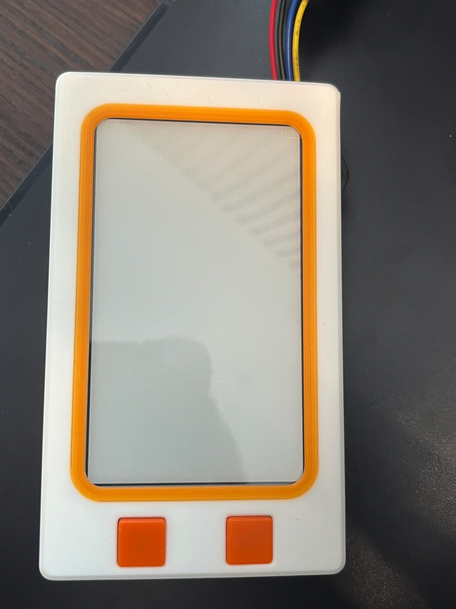

- Continuing to decipher the the command from last time
	- There is a lot of documentation and lots of acronyms and I got quite confused so I consulted claude
	- As suspected the reason why there aren't a ton of settings being manually configured is because they are already correct by default. The UC8253 has a OTP (one time programmable memory) and GooDisplay programs that memory for the panel in the factory.
	- All the 0x50 command with 0x97 data is doing is setting the border data selection. There is an electrode border around the screen which can be white or black. Setting DDX[0] to 1 with VBD = 10 uses the K->W lookup table, black to white. So simply makes the border white. I tested it with VBD = 01 to make it black and that worked as well.
		- {:height 508, :width 316}
	- With that out of the way I can just worry about communicating with the screen to send pixel data.
	- I'm just writing up my own version of the init
		- With the built in HAL Spi calls and I see myself wanting to use HAL_TRY again so I'm making a .h file for hal utils so I can include them instead of copy pasting the same definition
		- I'm realizing that I'm manually setting CS to low and high and it would make sense if that was automatically managed. Looking into it can be done with NSS, but the pin dedicated to that is not the same I chose for EPD_CS so maybe for next time.
	-