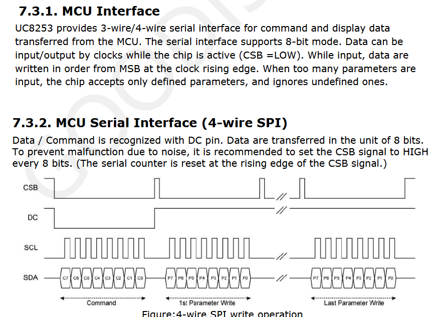

- Continuing to write driver for EPD
	- Cleaning up functions
	- Removed init and separated its internals
	- Made a bunch of different functions to interact with the screen, now I have enough to do the same as their first demo
		- ```
		    EPD_wakeup(&hspi3);
		  
		    EPD_set_border(&hspi3, BORDER_WHITE);
		    EPD_fill_screen(&hspi3, WHITE);
		    EPD_refresh(&hspi3);
		  
		    EPD_deepsleep(&hspi3);
		  ```
		- But it doesn't seem to be doing anything, I'm suspecting using HAL_SPI is what's wrong since I'm doing everything else the same
			- I'm looking into the CubeMX settings for the SPI peripheral and at the datasheet'
				- I've tied pin 8 low for the EPD meaning I'm using 4 line, 8 bit spi which is fine
				- 
				- I need to switch data size to 8 bits
				- First bit is MSB which is correct
				- I've disabled NSSP and NSS since we can't use the dedicated CS pin for SPI3
					- I realize that I need to toggle it each byte which I don't do in my code
				- I believe the frame format is Motorola since the CS pin doesn't pulse with the clock, and Motorola is the default/most popular option. I'm not 100% sure since it seems everyone talking about Motorola and TI frame format only mention one detail about it and I can't find any document that specifies TI's SPI frame format
				- From the diagram it's clear that the clock is default low so CPOL is Low and that the data is being sampled on the rising/first edge since on the falling the data is changing. So CPHA is 1 edge
				- The current clock speed is 16mhz and the prescaler is at 2 so max of 8.0 MBits/s which is fine. I noted previously that the max the driver can handle is 20mhz.
			- With those fixes done I flashed it again and it works. I also flashed it once without sending a white screen and it displayed noise which I found cool to see.
				- {:height 560, :width 281}
				-
-