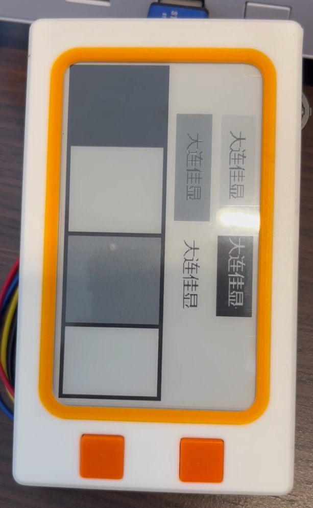
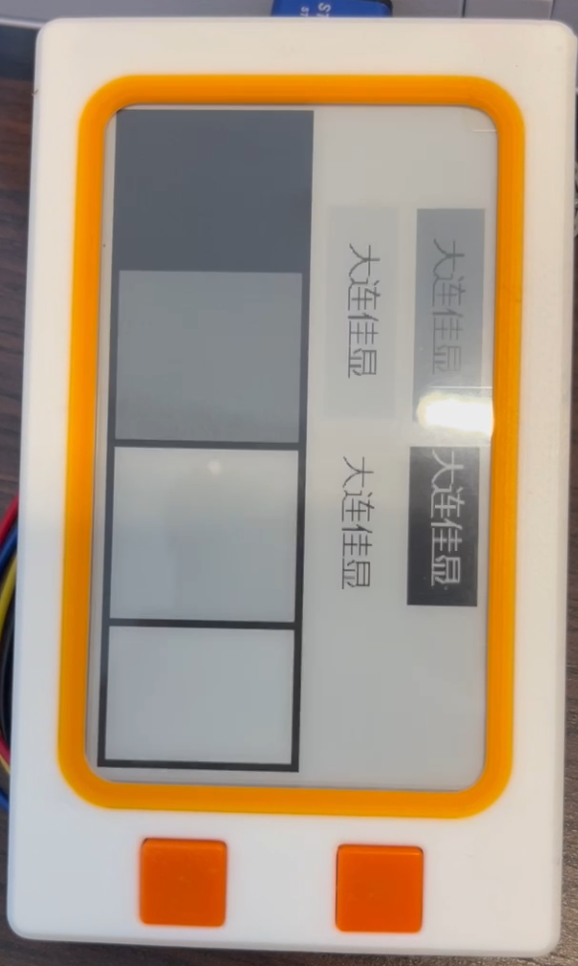
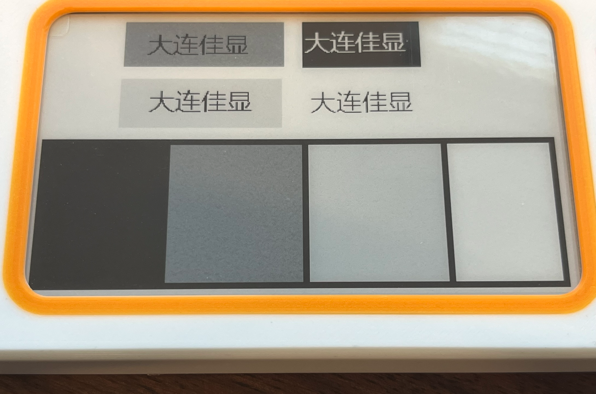
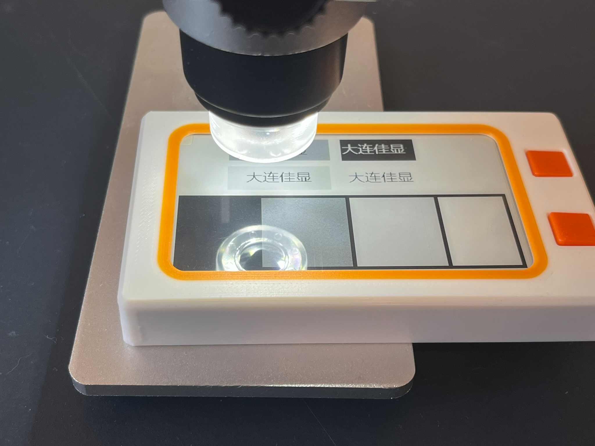
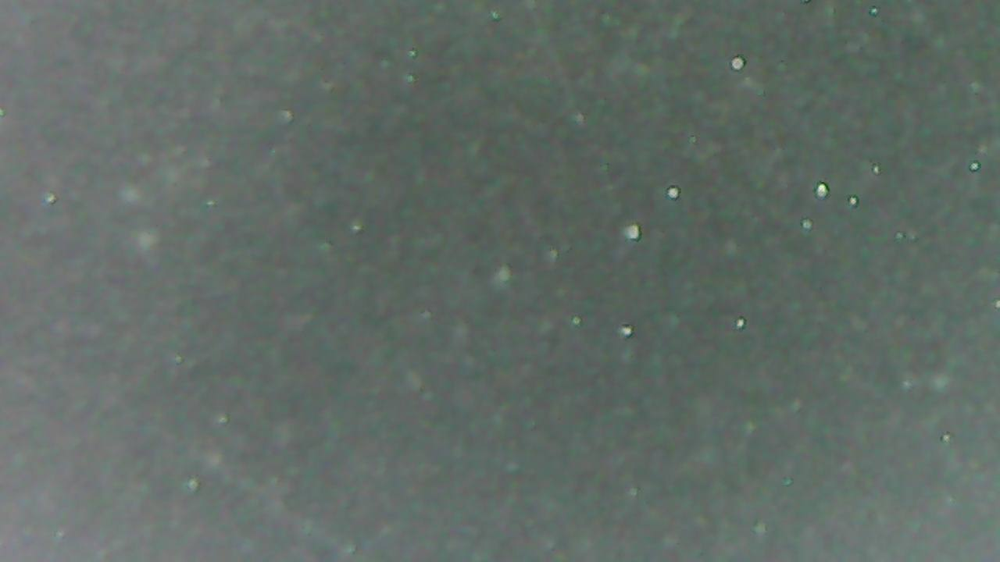
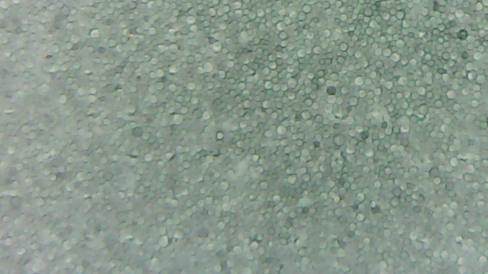
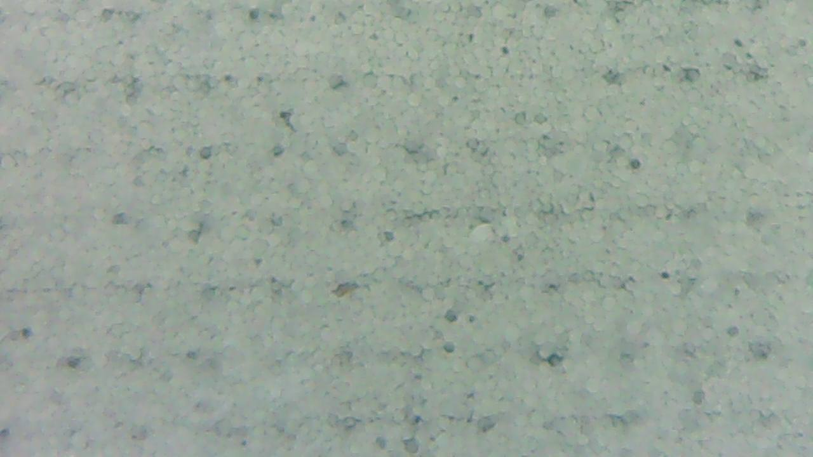
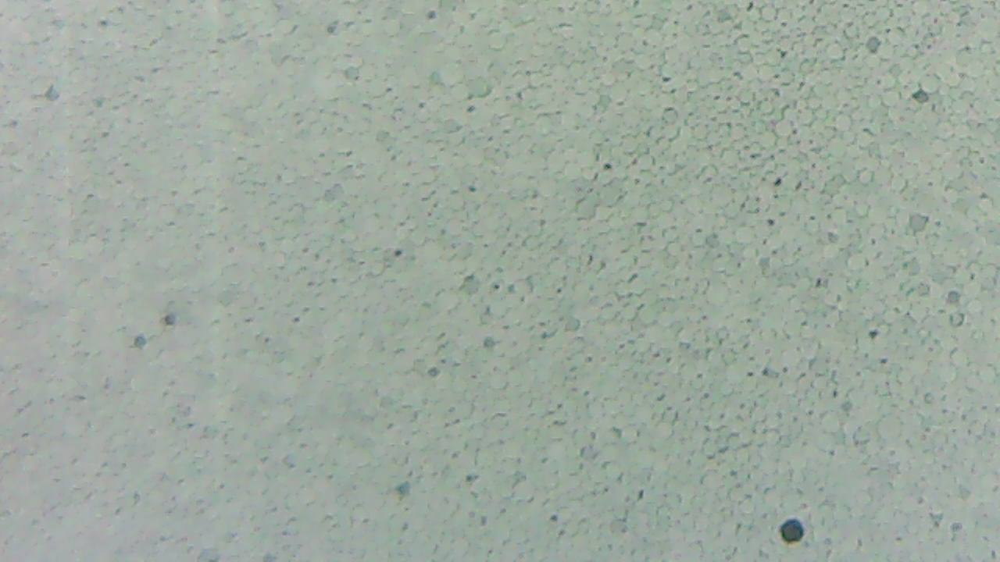
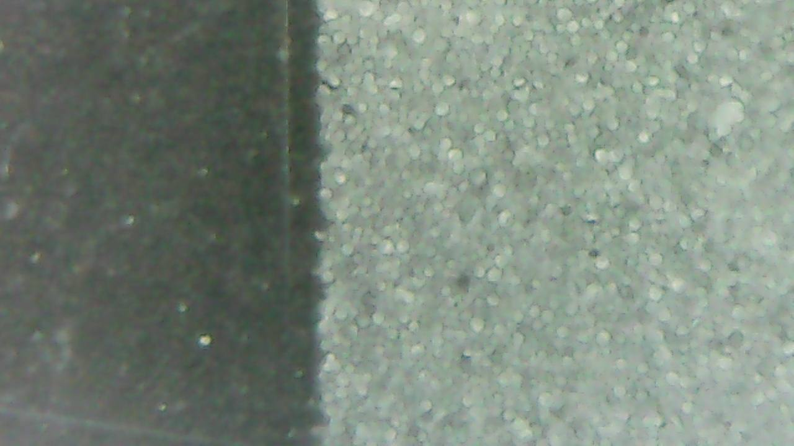

- Continuing to write driver for EPD
	- Starting with grayscale setting to see if I can use anti aliasing for the font
		- From their code
		- ```
		  void EPD_Init_4G(void) //
		  {	
		  	EPD_W21_RST_0;		// Module reset
		  	delay_xms(10);//At least 10ms delay 
		  	EPD_W21_RST_1;
		  	delay_xms(10);//At least 10ms delay 
		  
		  	EPD_W21_WriteCMD(0x00);
		  	EPD_W21_WriteDATA(0x1F);
		  	
		    EPD_W21_WriteCMD(0x04);  //Power on
		  	lcd_chkstatus();        //waiting for the electronic paper IC to release the idle signal
		  
		  	EPD_W21_WriteCMD(0xE0);
		  	EPD_W21_WriteDATA(0x02); 
		  
		  	EPD_W21_WriteCMD(0xE5);
		  	EPD_W21_WriteDATA(0x5A);  //0x5A--4 Gray
		  	
		  }	
		  ```
			- They begin by resetting, fine.
			- Then they set the settings to what should be default, except the resolution which is set to 00b or 240x120. But none of the resolution options match the screen so I assume they programmed the driver to use the proper resolution at 00b.
			- Then they power on and wait, fine
			- Then they bypass the internal temperature sensor and set their own temperature
				- From reading up on EPD technology and from claude I think what they're doing is setting the temperature high so that the driver sends short pulses. It does so because the fluid in the screen would be less vicious so requires a shorter pulse to move the pixels. But since we're not actually at that temperature sending a short pulse doesn't move all the black dots to the front so we see a mix of white and black or gray.
				- I think this is confirmed by their comment above the function to send an image in gray:
					- ```
					  //4 grayscale demo function
					  /********Color display description
					        white  gray1  gray2  black
					  0x10|  01     01     00     00
					  0x13|  01     00     01     00
					  ```
					- If the old data (0x10)/previous pixel was white and we tell the screen to go to black (0x13) then it creates a light grey, as only some black came up. If it was black and we tell it to transition to white then it's a dark gray, as only some white came up.
			- With this, I'm curious what sending the image twice would do. As if we have a gray1 then send gray1 again (white to black) then I feel like it should become gray2. This would mean you need to clear the screen between grayscale uses. I will test it out by using their example code and just calling the grayscale image function then refreshing. That way the old_data and new_data stay the same it just does the same operation twice. I will also try calling the grayscale image function twice in case the old_data and new_data become discarded after a refresh. The grayscale image function sets both the old and new data bits the same, it passes in data that is twice is the screen buffer and packs the bits as alternating old then new so 4 pixels per byte.
				- The refresh did nothing, as in it refreshed but the image stayed the same
				- The double function call did as expected, everything stayed the same but gray1 -> gray2 and gray2 -> gray1.
					- {:height 422, :width 254}
					- {:height 428, :width 247}
				- Looking at it very closely I could see some white in the dark gray and some black in light gray so I wanted to take a look under the microscope
					- You can see mainly the dark gray looks noisy, not as uniform as the rest
					- {:height 267, :width 365}
					- {:height 378, :width 506}
					- Black
					- {:height 227, :width 429}
					- Dark gray
					- {:height 200, :width 436}
					- Light gray
					- {:height 199, :width 436}
					- White
					- {:height 164, :width 444}
					- Transition from black to dark gray
					- {:height 223, :width 442}
				- It would be interesting to see how this changes under different temperatures
				- I tried running the function 4 times instead of two and instead on the third call it looks like the function was called once, and on the 4th like it was called twice. It seems to flip flop between gray1 <-> gray2 instead of my assumption that one gray would keep getting darker and one lighter since we push them from going from "white" to "black" or other way round. So I was thinking every time more black or white dots would be pushed up. Anyway this was just for interest, I can move on
	- Now I checked out the partial refresh and fast refresh init
		- They both almost do the same thing as the grayscale init. And reading the datasheet for the max operating temperature, that's 50 degrees C. Grayscale sends 90 degrees, fast refresh 95 degrees and partial 110 degrees.  This leads me to believe that they aren't temperature but just lets the driver know the mode we want. It also would explain why my hypothesis for calling the grayscale image function more than twice was false.
		- The partial refresh init sets the border LUT to floating, presumably so the border doesn't refresh every time the screen does. It would be weird if the border flashed when updating the middle of the screen