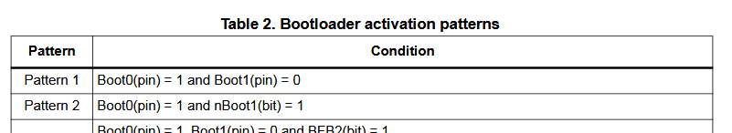

The board wakes up on a rising edge. So i can use an inverting schmitt trigger so that when i press the button to discharge the capacitor the output will go high. But then looking at the leakage current of a cap it seemed too high for my liking. So I was thinking of charging the cap on a button press. And then in that search I learned that all the gpios already have schmitt triggers on them. When making the pins analog to reduce power consumption we disable the schmitt triggers which take power on standby. They are used so digital pins only receive high orlow. So test that I will just put an rc circuit on the button without the external schmitt trigger. That does appear to be true, no bounces.

Battery holder: https://www.lcsc.com/product-detail/C7498148.html There are cheaper but those are larger and harder to take the battery out. This is smt and low profile

Right angle headers to keep it low profile and i can program it: https://www.digikey.ca/en/products/detail/adam-tech/PH1RB-08-UA/9831008

Going to use 0 ohm resistor or solder jumper between the battery and vcc so i can measure current when needed

Will use a slide switch to disable leds if i put any

m3x6 standoff. the battery holder is 5.5mm. this will let me screw a case onto it. https://www.lcsc.com/product-detail/C2916383.html

Might use a slide switch or thumbwheel switch to switch "modes" so I can go into a configure rtc mode where push buttons are +1hr or something

Will use these push buttons: https://www.mouser.ca/ProductDetail/Omron-Electronics/B3F-5050?qs=dOLq8QE0Pqqk%2FO9x2OpTQw%3D%3D with caps (maybe these https://www.digikey.ca/en/products/detail/omron-electronics-inc-emc-div/B32-1310/11535). I have them on hand, good size and look good.

Now I have a general idea of all I need except for the MCU stuff like a clock. Making a sheet checklist trying to make sure I have everything is going to be tedious. I'm just going to add everything I need on a schematic so I can see how they're grouped. This will also generate a BOM for me.

I started with the chip and realized that the one I chose is BGA which I cannot solder or easily check connections. So I'm switching to the same one in a different package which is significantly more expensive ($1.5) but doesn't matter for my one of use. https://www.lcsc.com/product-detail/C22391359.html. The exact same part in with 128kB flash instead of 256 is less than half the price. But again one time use. 

Need a fpc connector for the screen, mine is 24 pin 0.5mm pitch. Used a double sided connector to eliminate any mistakes. Found a 10uH 1A shielded inductor as stated in their datasheet. Used the other components they used, there were so many options for mbr0530. They have a boost converter.

Time to delve into the RTC. Gonna just read through the datasheet\
They have a demo board which is nice to take a look at. It looks like their headers are low profile and they have jumpers this is exactly what I want.\
Pins:
- 1 = clkout, not needed disable this using register settings. Can leave floating?
- 2 = !int, open drain, pull high using internal pull up. configure for alarm
- 3 = scl, needs a pull up resistor. need to figure out values
- 4 = sda, needs a pull up resistor. ^
- 5 = Vss = gnd
- 6 = Vbackup, tie to gnd with 10k if not used. Will probably tie to cap for backup power
- 7 = Vdd, 3.3v
- 8 = EVI, external event input. Should not be left floating. Need to read more

The pull up resistor for i2c is not fixed so i must find the one i need. I will use https://www.ti.com/lit/an/slva689/slva689.pdf?ts=1772506262280 as a guide. I need Vol which is the max voltage that is read as low by the MCU. For the one i've chosen this is 0.4V, so 0-0.4V is read as logic low. I also need the max current the RTC open drain pins can sink. At 3V for clk its 1mA, SDA and !INT its 3mA (page 98). With this the minimum pull up resistance is 3k for CLK, and 1k for SDA and !INT. With a lower resistance too much current would go through and the RTC would not be able to pull low. The RTC uses the i2c fast mode which is 400 kHz which has a rise time from Vol to Vih (lowest high logic level) of 300ns for both SDA and SCL. The formula becomes 300ns = 0.8476 * rp (max) * c load. I asked gemini for a c estimate, for one device and short traces I can expect about 20pF. For standard mode i2c has a max for 400pf. Solving i get max of 17.7k for the 3 pins. The standard is 4.7k which is fine, but id rather higher to reduce power consumption, but also i barely need to communicate with it just interrupt which is also just once a day. I can try to measure the capacitance when I design the PCB but doesn't matter much.  

The RTC has 2 bytes of ram and 43 bytes of eeprom i can use i case I don't want to store values in the backup registers in the mcu.

To note: "Because of this method, it is very important to make a read or write access in one go, that is, setting or reading seconds through to years should be made in one single access. Failing to comply with this method could result in the time becoming corrupted" page 52. When writing the time it resets the prescaler unless writing after the seconds. 

In the demo board they use a capacitor for backup power. Its just 100 uF so I was curious how long the RTC would last on that: \
1/2\*100\*10^-6\*(3.3^2-1.1^2) = 0.000484 joules of energy while rtc still on\
(3.3+1.1)/2\*45\*10^-9 = 0.000000099 average watts while rtc on\
0.000484 / 0.000000099 = 4888 seconds = 81 minutes on backup power

For the bootloader I had a thought when thinking about the board. Why do I need a bootloader, the stlink programs it through serial and when i googled it, it seems the bare chip doesnt come with a bootloader. As my board isn't a stm board it just has a stm mcu it might've never been programmed with a bootloader which is why i could never put it into the bootloader. I knew for sure the nucleo boards would have a bootloader so I found out the pattern for it.  \ nBoot1 was default high so I tited boot0 high and sure enough the program stops running. Glad I didn't stay stuck trying to figure it out in one sitting.