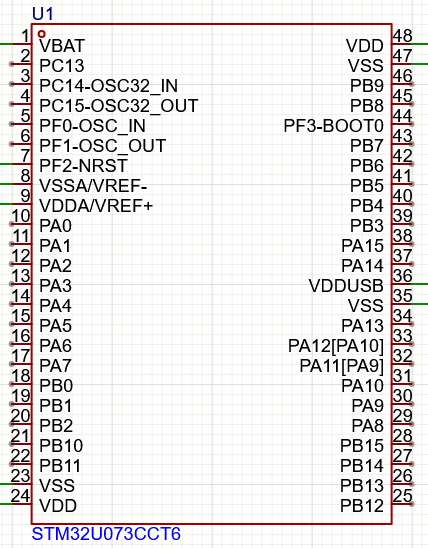
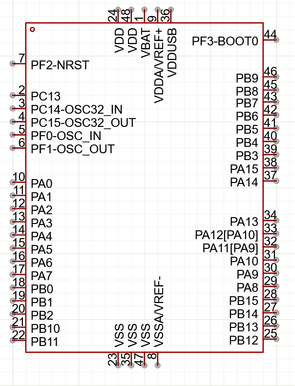
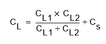
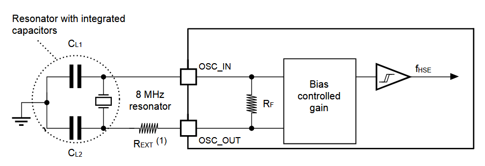
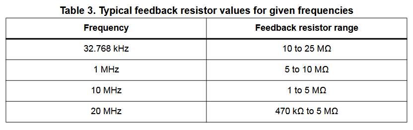
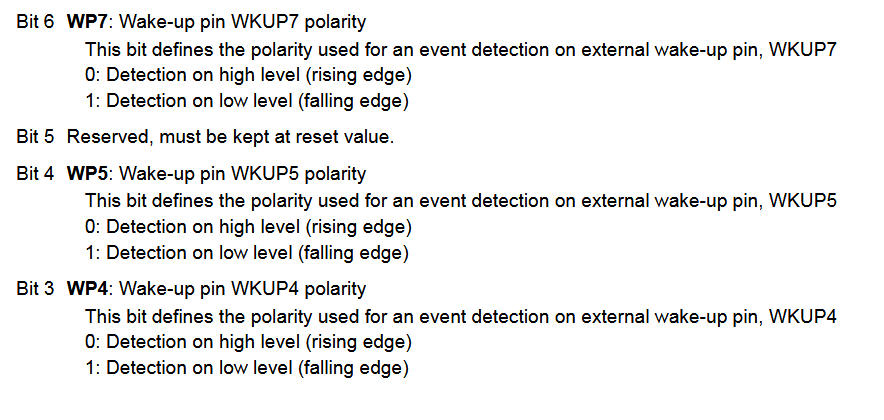

"The VDDA pin must preferably be connected to the VDD voltage supply when these peripherals are not used"

"If no external battery is used in the application, it is recommended to connect the VBAT pin externally to VDD with a 100 nF external ceramic decoupling capacitor"

Added all the components from yesterday. Modified mcu and switch schematic symbols so they're not so ass.
 

Now for choosing the crystal. I'm using their guide "Guidelines for oscillator design", i was guided there by the datasheet. There are two ranges the mcu can run at, the slower one at lower voltages and power. Which I will probably use. In that mode a max of 19mhz hse can be used. A standard value is 8 or 16 and stm example uses 8 and i have 8 on hand. To run the oscillator we need load capacitors, as the crystal can be modeled using an RLC circuit we can change these load capacitor values to change the frequency. The capacitor value can be calculates as such:  The crystal I chose specifies a load capacitance (series equivalent capacitance) of 20pF, and has a stray/shunt capacitance from the electrodes as 7pF, for now I will say the pins/traces will add another 3pF. So 20 = (CL1*CL2)/(CL1+CL2)+10. As CL1=CL2 we get they have to be 20pF. Note: they say to use high quality capacitors that are meant for high frequency. I am using a through hole crystal for ease of soldering. Here is the oscillator circuitry:  I've chosen my oscillator and load capacitors, now I just need to see if i need an external resistor and if so what value. There is already an internal resistor but on the U0 it has a value of 200k which seems awfully low given their chart . This resistor is used to limit the power to the crystal to not overdrive it/drive it to higher harmonics and break it. The external resistor value should be somewhere around the impedence of one of the load capacitors so 1k for my case. They recommend then using a pot to adjust and test but im not sure how to add one without adding too much trace length. I don't think it matters that much so I will just put the resistor there. I can always just manually change the resistor value if it's not working. No gain margin parameters are specified so I can't do anything about them. 

Testing the thumbswitch to figure out how it works, using multimeter. I now understand, soldered some wires to it. And testing it out in code to make sure I configure the final one properly. 10k pull up on com (A) then two interrupts for left and right pulled low. On interrupt blink once for left, twice for right. PC9 and PC8 not broken out? Will use PA8 and PA9 instead. Not working, pull down resistor too high? Pull up instead and connect COM straight to gnd. Still not working, check with debugger. Hanging on HAL_Delay. The problem is I used HAL_Delay inside my interrupt service routine. But HAL_Delay checks how many ticks have gone by, but for ticks to go up there is an interrupt every ms to increment a number. As my interrupt had a higher priority it simply ignored this 1ms interrupt so it never incremented. By setting it as a higher priority it will handle it before mine and all goes well. The switch works well. I do now realize the device would be off so this pins need to turn it on, but what if i switch while the device is awake. I have two wakeup pins left so i will use one for each side, so I will externally tie COM to high using a pullup. Then the left and right pins will pull high when switched to, to turn on the MCU. When on I can reconfigure them to be interrutps and then back to wakeup right before going back to shutdown mode. I can actually configure it to wake on rising or falling edge , so no need for an inverter on RTC interrupt. Good, cause I was concerned about quisecent current.